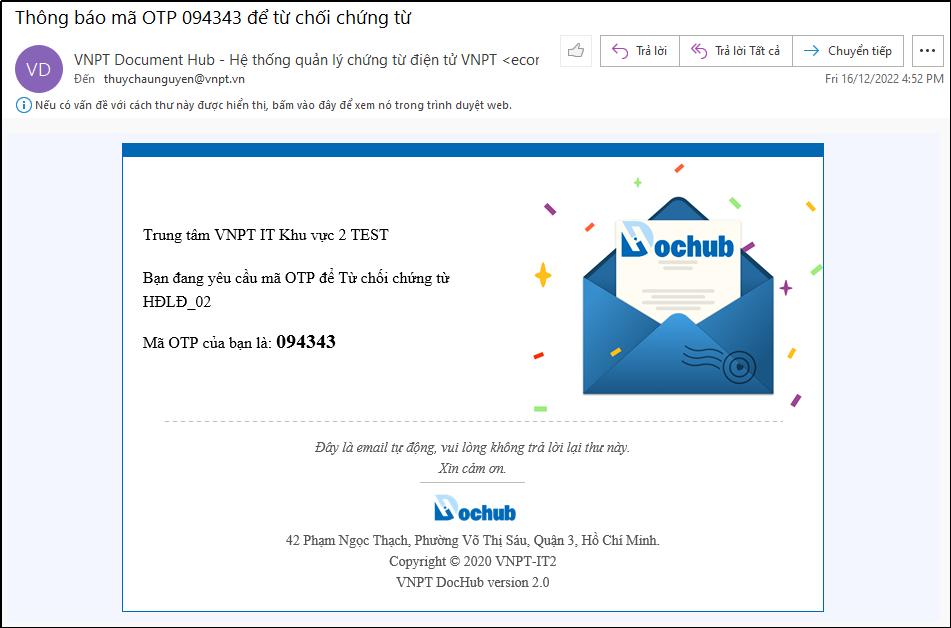
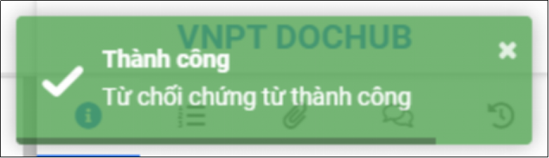

# 10.Ký số USB Token
## 10.1.Ký số USB Token một chứng từ
Trước khi thực hiện ký số bằng USB Token, người ký cần thực hiện: 
* Cài đặt plugin ký số của VNPT.
* Kiểm tra và chọn đúng phương pháp ký số “Ký số USB Token” trên hệ thống DocHub.

Thông tin tải plugin ký số của VNPT: truy cập vào link https://kyso.vnpt-ca.vn/, chọn menu “Plugin ký số”, chọn phiên bản tải về phù hợp với hệ điều hành máy tính:

Hình 117: Thông tin tải plugin ký số của VNPT

Sau khi hoàn thành cài đặt plugin ký số, tiến hành kiểm tra thông tin tài khoản trên hệ thống DocHub đã chọn đúng phương pháp ký số là Ký số USB Token chưa, nếu chưa thì chọn lại cho đúng và lưu lại cập nhập:

Vào “**Quản lý tài khoản**” > Chọn “**Cập nhật thông tin**”> Chọn “**Phương pháp ký**” là “**Ký số USB Token**” > Nhấn “**Lưu**”

Hình 118: Chọn phương pháp ký "Ký số USB Token"

Tiến hành ký số chứng từ bằng Ký số USB Token:
* **Bước 1**: Nhận thông báo chứng từ cần xử lý

Người thực hiện ký số chứng từ sử dụng Link hoặc Mã xử lý được hệ thống thông báo qua Email hoặc SMS:

Hình 119: Link và Mã xử lý chứng từ được thông báo qua Email

Hình 120: Mã xử lý được thông báo qua SMS
* **Bước 2**: Mở màn hình xử lý chứng từ

Nhấn vào link xử lý trong email thông báo chứng từ (bước 2) để vào màn hình xử lý chứng từ để thực hiện ký số chứng từ. 

Trường hợp sử dụng Mã xử lý thì phải đăng nhập vào hệ thống DocHub bằng mã xử lý.

Hình 121: Đăng nhập bằng mã xử lý để vào màn hình xử lý chứng từ

Hình 122: Màn hình xử lý chứng từ

* **Bước 3**: Ký số chứng từ

Tùy vào mục đích sử dụng của người dùng mong muốn, có thể chọn ký số bằng VNPT-CA plugin phiên bản mặc định của hệ thống hoặc chọn thêm “Ký nâng cao” để tùy chọn điều chỉnh các thông tin chữ ký, hình ảnh và các chức năng mở rộng.
* **Ký số bằng VNPT-CA plugin mặc định của hệ thống:**
**Bước 3.1:** Người dùng thực hiện điều chỉnh thông tin và hình ảnh ký số (nếu cần)
**Bước 3.2:** Thực hiện ký số chứng từ bằng VNPT-CA Plugin
Thực hiện điều chỉnh các thông tin trước khi ký số (nếu cần) như: Vị trí ký, Nội dung chữ ký, Lí do, Kích cỡ phông chữ, Chọn hiển thị thông tin chữ ký: chỉ văn bản hoặc chỉ hình ảnh hoặc cả văn bản & hình ảnh, Thêm hình chữ ký hoặc vẽ 

Hình 123: Các thông tin về chữ ký mà người ký có thể cập nhật trước khi ký chứng từ

Để thay đổi hình ảnh chữ ký, Nhấn “**Thêm hình**” để cập nhật hình ảnh chữ lý hoặc vẽ hình ảnh chữ ký của bạn, nhấn “**Thêm hình chữ ký**” để sử dụng hình ảnh:

Hình 124: Cập nhật hình ảnh chữ ký

Sau khi đã cập nhật các thông tin và hình ảnh chữ ký, nhấn nút “Ký số bằng VNPT-CA Plugin” trên màn hình để thực hiện ký số chứng từ, hệ thống máy tính sẽ hiển thị danh sách các chứng thư số của người dùng, người dùng chọn chứng thư số rồi nhấn “OK” để hoàn thành ký số.

Hình 125: Nhấn "Ký số bằng VNPT-CA Plugin" để ký số chứng từ

Hình 126: Màn hình đang xử lý yêu cầu của người dùng

Hệ thống hiển thị danh sách chứng thư số, người dùng lựa chọn chứng thư số để thực hiện ký số chứng từ:

Hình 127: Danh sách chứng thư số của người dùng

Chọn chứng thư số và nhấn “**OK**” để hoàn tất quá trình ký số bằng VNPT-CA plugin mặc định của hệ thống.

Hình 128: Thông báo chứng từ được ký thành công trên hệ thống DocHub

* Ký số bằng VNPT-CA plugin nâng cao:
Check chọn “Ký nâng cao” và nhấn “Ký số bằng VNPT-CA plugin” để thực hiện ký số nâng cao bằng VNPT-CA plugin.
* **Bước 3.1**: Người dùng thực hiện điều chỉnh thông tin và hình ảnh ký số (nếu cần)
* **Bước 3.2**: Thực hiện ký số chứng từ bằng VNPT-CA Plugin

Hình 129: Chọn ký nâng cao VNPT-CA Plugin

Với tính năng ký nâng cao này, người dùng có thể tùy chỉnh các chế độ ký với những tùy chọn nâng cao như: Mã hóa file, Gán nhãn thời gian, Hiển thị thông tin chữ ký, Vị trí và hình ảnh chữ ký, Giao diện chữ ký và các tùy chỉnh văn bản ký:

Hình 130: Các thông tin về chữ ký mà người ký có thể cập nhật trước khi ký chứng từ

Sau khi đã cập nhật các thông tin và hình ảnh chữ ký, nhấn nút “Áp dụng” trên màn hình để hoàn thành ký số.

Hình 131: Thông báo chứng từ được ký thành công trên hệ thống DocHub

## 10.2.Ký số USB Token hàng loạt (nhiều) chứng từ
- Cho phép người dùng xử lý hàng loạt chứng từ (cùng lúc nhiều chứng từ) trong cùng một lô import hoặc không cùng một lô.
- Điều kiện để xử lý hàng loạt chứng từ theo lô: chứng từ xử lý phải cùng một lô import và cùng quyền xử lý ký số.
- Điều kiện để xử lý hàng loạt chứng từ không cùng một lô: chứng từ xử lý phải cùng cùng quyền xử lý ký số.
- Để tìm kiếm chứng từ cùng một lô, tại màn hình “Danh sách chứng từ” sử dụng bộ lọc “Nâng cao” trên màn hình để tìm kiếm lô chứng từ cần xử lý, chọn danh sách các chứng từ cần xử lý và thực hiện ký số chứng từ

Hình 132: Mở bộ lọc nâng cao tại màn hình Danh sách chứng từ

Hình 133: Tìm kiếm lô chứng từ cần xử lý bằng bộ lọc nâng cao

Hình 134: Màn hình kết quả danh sách các chứng từ trong lô cùng quyền xử lý

- Hoặc để tìm kiếm chứng từ có cùng quyền xử lý dành cho trường hợp xử lý hàng loạt chứng từ không cùng một lô. Tại màn hình “Danh sách chứng từ” sử dụng bộ lọc nhanh trên màn hình để tìm kiếm các chứng từ cùng quyền xử lý: ký số 

- Chọn danh sách các chứng từ cần xử lý:

Hình 135: Chọn các chứng từ cần xử lý
- Tại đây, người dùng thực hiện ký số chứng từ cùng lô tương tự như xử lý ký số chứng từ không theo lô.
- Ngoài ra, người dùng thực hiện nhấn <- hoặc -> để review chứng từ hoặc xem “Danh sách chứng từ” trước khi xử lý hàng loạt chứng từ cùng lô.

Hình 136: Màn hình xử lý chứng từ hàng loạt theo lô

## 10.3.Từ chối ký số chứng từ
Trường hợp từ chối ký chứng từ, tương tự như ký chứng từ, sau khi hoàn thành bước 2 (Mở màn hình xử lý chứng từ) người ký nhấn nút “Từ chối” để từ chối ký chứng từ:

Hình 137: Nhấn "Từ chối" để từ chối ký số chứng từ

* Trường hợp người dùng sử dụng xác thực 2 lớp: khi từ chối ký số chứng từ người ký phải nhập thêm lý do từ chối và mã OTP được thông báo qua Email hoặc SMS:
  

Hình 138: Trường hợp sử dụng xác thực 2 lớp

Hình 139: Thông báo email mã OTP xác thực 2 lớp

Hình 140: Thông báo SMS mã OTP xác thực 2 lớp

Nhập lý do và mã OTP để hoàn thành từ chối ký số chứng từ:

Hình 141: Nhập mã OTP để thực hiện từ chối ký số chứng từ

* Trường hợp người dùng không sử dụng xác thực 2 lớp: 

Hình 142: Trường hợp không sử dụng xác thực 2 lớp

Nhấn “Xác nhận” để từ chối ký chứng từ:

Hình 143: Thông báo từ chối chừng từ thành công