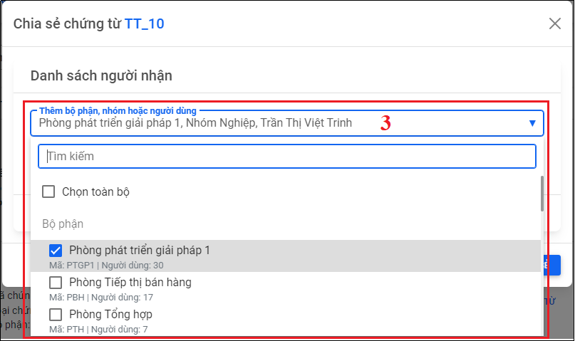
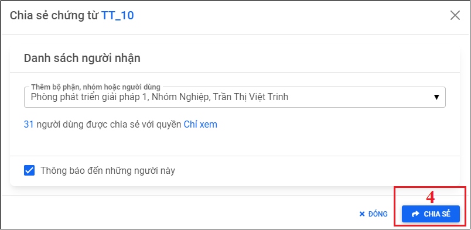
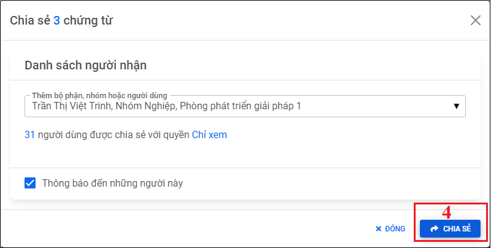
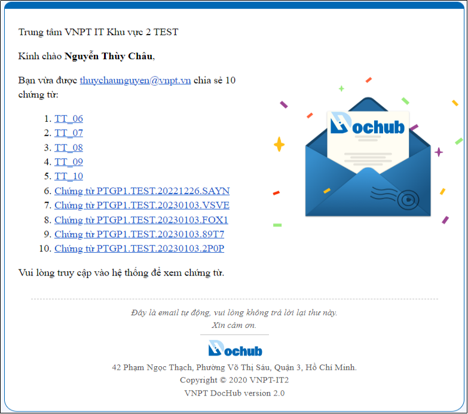

# 13. Chia sẻ chứng từ
Cho phép người dùng chia sẻ một chứng từ hoặc chia sẻ nhiều chứng từ cho một hoặc nhiều người dùng khác nhau có trên hệ thống.
## 13.1. Chia sẻ một chứng từ
- Chức năng cho phép người dùng chia sẻ một chứng từ đã hoàn tất của mình cho một hoặc nhiều người dùng khác trên hệ thống
- Trên màn hình “Danh sách chứng từ” chọn chứng từ do người dùng tạo và đã hoàn tất quy trình, nhấn “Chia sẻ chứng từ”, cửa sổ chia sẻ chứng từ hiện ra cho người dùng nhập tên người dùng, nhóm người dùng, bộ phận cần chia sẻ, nhấn “Chia sẻ” để hoàn tất quá trình.

Hình 189: Màn hình Danh sách chứng từ

Hình 190: Chọn người dùng cần chia sẻ

Hình 191: Nhấn "Chia sẻ" để chia sẻ chứng từ

Hình 192: Chia sẻ chứng từ thành công

Hình 193: Chứng từ được chia sẻ được thông báo qua email cho người nhận

## 13.2. Chia sẻ nhiều chứng từ chứng từ
- Chức năng cho phép người dùng chia sẻ nhiều chứng từ đã hoàn tất của mình cho một hoặc nhiều người dùng khác trên hệ thống
- Trên màn hình “Danh sách chứng từ” chọn những chứng từ do người dùng tạo và đã hoàn tất quy trình, nhấn “Chia sẻ chứng từ”, cửa sổ chia sẻ chứng từ hiện ra cho người dùng nhập tên người dùng, nhóm người dùng, bộ phận cần chia sẻ, nhấn “Chia sẻ” để hoàn tất quá trình.

Hình 194: Chọn các chứng từ cần chia sẻ

Hình 195: Chọn người dùng cần chia sẻ

Hình 196: Nhấn "Chia sẻ" để thực hiện chia sẻ chứng từ

Hình 197: Chia sẻ chứng từ thành công

Hình 198: Danh sách chứng từ được chia sẻ được thông báo qua email cho người nhận