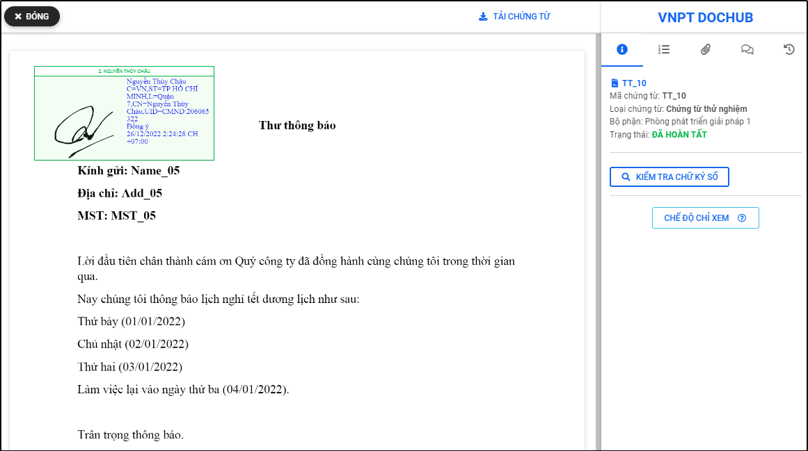
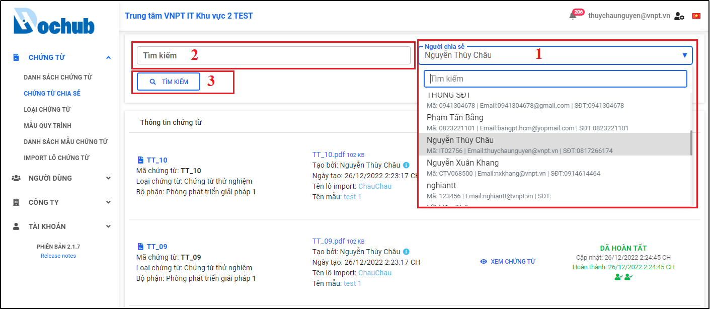

# 14. Quản lý Chứng từ chia sẻ
- Màn hình cho phép người dùng xem danh sách và chi tiết các chứng từ đã được chia sẻ với người dùng trên hệ thống
- Trên menu “Chứng từ” chọn màn hình “Chứng từ chia sẻ”, danh sách các chứng từ được chia sẻ với người dùng được hiển thị

Hình 199: Màn hình "Chứng từ chia sẻ"

## 14.1. Xem chứng từ:
- Cho phép người dùng xem chi tiết một chứng từ cụ thể từ danh sách chứng từ được chia sẻ
- Tại màn hình “Chứng từ chia sẻ”, chọn chứng từ cần xem chi tiết, nhấn “Xem chứng từ” để mở màn hình chi tiết chứng từ.

Hình 200: Sử dụng tính năng xem chi tiết một chứng từ

Hình 201: Màn hình chi tiết chứng từ

## 14.2. Tìm kiếm chứng từ được chia sẻ:

- Cho phép người dùng tìm kiếm theo tên và người chia sẻ chứng từ từ danh sách chứng từ được chia sẻ.
- Tại màn hình “Chứng từ chia sẻ” nhập tên người chia sẻ hoặc tên chứng từ cần tìm, nhấn “Tìm kiếm” để tìm kiếm chứng từ từ danh sách được chia sẻ với người dùng.

Hình 202: Tìm kiếm chứng từ được chia sẻ với tôi

