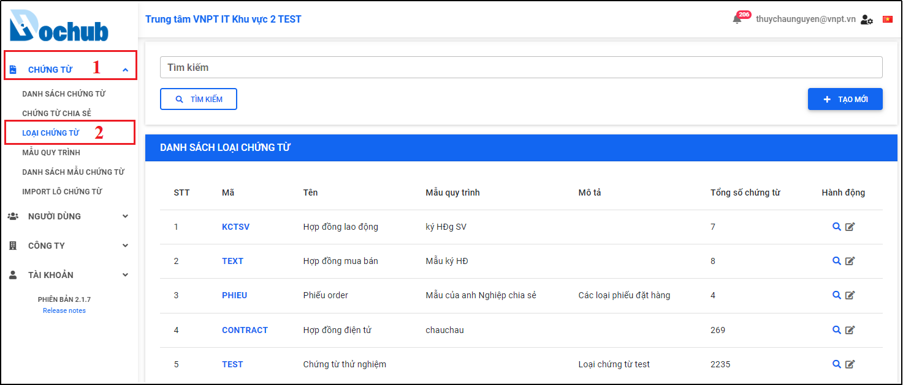
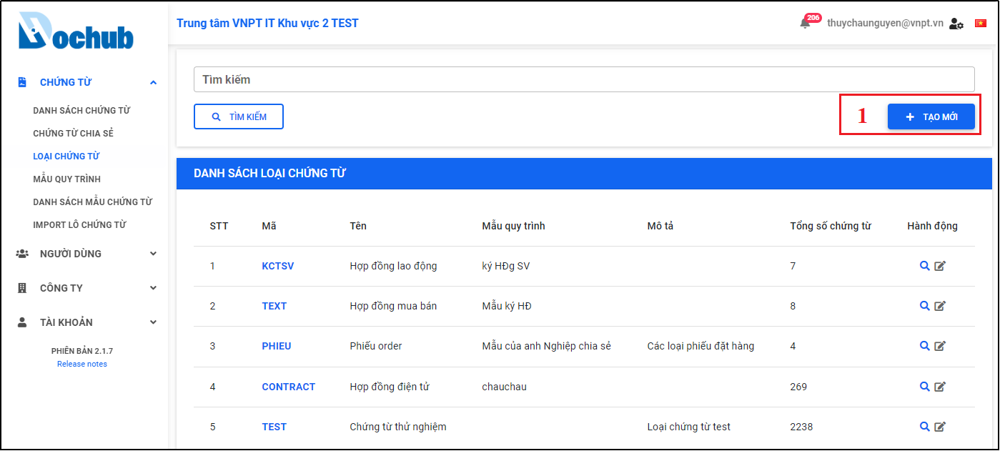
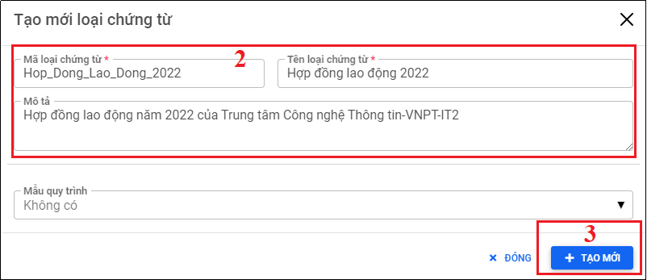
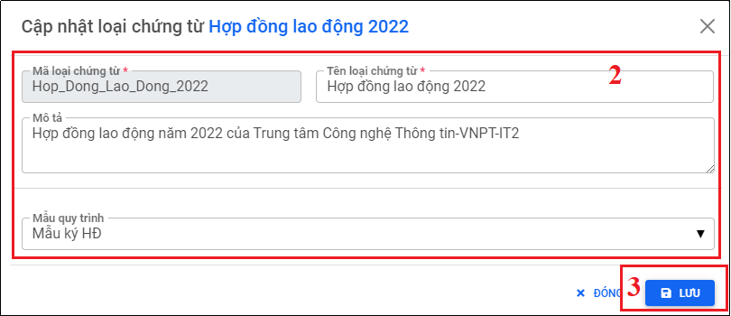
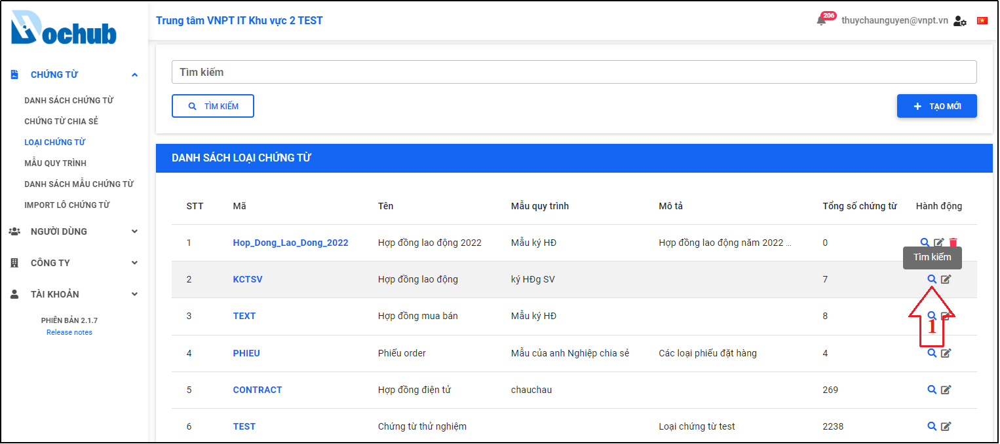
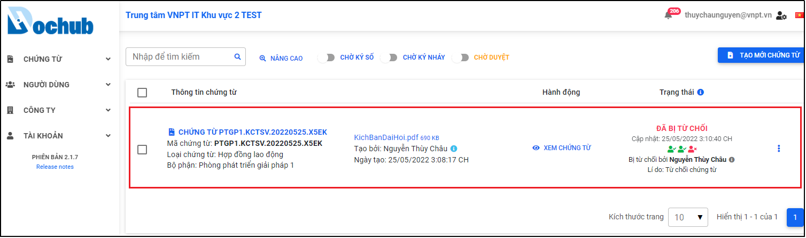
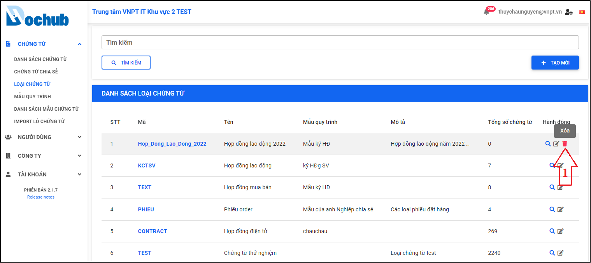
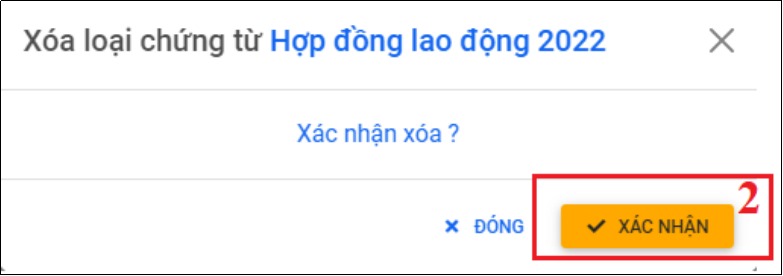
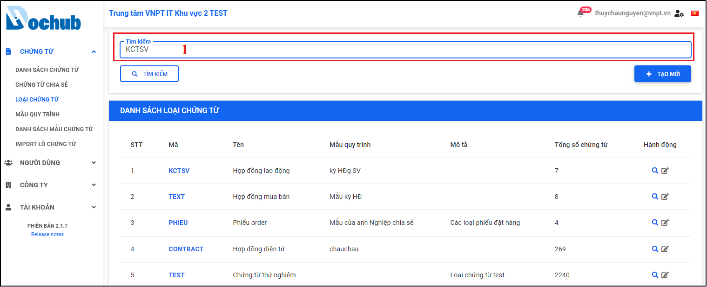
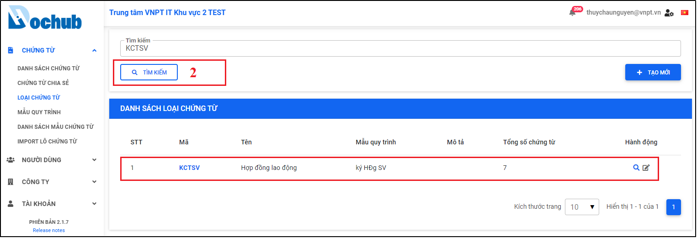

# 15. Quản lý Loại chứng từ
- Màn hình cho phép người dùng quản lý các loại chứng từ trên hệ thống như: Tạo mới, Xóa loại chứng từ, Cập nhật loại chứng từ, Tìm kiếm chứng từ theo từng loại chứng từ, Tìm kiếm theo tên loại chứng từ
- Trên menu “Chứng từ” chọn màn hình “Loại chứng từ”, màn hình quản lý loại chứng từ xuất hiện.

Hình 203: Màn hình quản lý loại chứng từ

## 15.1. Tạo mới loại chứng từ
- Cho phép người dùng tạo mới loại chứng từ trên hệ thống.
- Tại màn hình “Loại chứng từ”, nhấn “Tạo mới” để mở cửa sổ tạo mới loại chứng từ, người dùng nhập các thông tin cần thiết và nhấn “Tạo mới” để tạo mới một loại chứng từ.

Hình 204: Nhấn "Tạo mới" để mở cửa sổ tạo mới loại chứng từ

Hình 205: Nhập và chọn thông tin cần thiết để tạo mới loại chứng từ

Hình 206: Thông báo tạo mới loại chứng từ thành công

## 15.2. Cập nhật loại chứng từ
- Cho phép người dùng cập nhật thông tin loại chứng từ trên hệ thống.
- Tại màn hình “Loại chứng từ”, chọn loại chứng từ cần cập nhật, nhấn icon “Cập nhật” để mở cửa sổ cập nhật loại chứng từ, người dùng thực hiện cập nhật lại các thông tin và nhấn “Lưu” để cập nhật lại thông tin loại chứng từ.

Hình 207: Nhấn icon “Cập nhật” để mở cửa sổ cập nhật loại chứng từ

Hình 208: Cập nhật lại các thông tin loại chứng từ

Hình 209: Thông báo cập nhật loại chứng từ thành công

## 15.3. Tìm kiếm chứng từ đã tạo từ loại chứng từ
- Cho phép người dùng tìm kiếm danh sách các chứng từ đã tạo từ loại chứng từ cụ thể.
- Tại màn hình “Loại chứng từ”, chọn loại chứng từ cần xem danh sách chứng từ đã tạo, nhấn icon “Tìm kiếm” để mở màn hình danh sách chứng từ được tạo từ loại chứng từ đã chọn.

Hình 210: Chọn loại chứng từ cần tìm danh sách chứng từ đã tạo

Hình 211: Danh sách chứng từ đã tạo từ loại chứng từ đã chọn

## 15.4. Xóa loại chứng từ
- Cho phép người dùng xóa loại chứng từ khỏi hệ thống.
- Tại màn hình “Loại chứng từ”, chọn loại chứng từ cần xóa, nhấn icon “Xóa”, cửa sổ xác nhận xóa loại chứng từ xuất hiện, người dùng nhấn “Xác nhận” để thực hiện xóa loại chứng từ ra khỏi hệ thống.

Hình 212: Chọn loại chứng từ cần xóa

Hình 213: Xác nhận xóa loại chứng từ

Hình 214: Thông báo xóa loại chứng từ thành công

## 15.5. Tìm kiếm loại chứng từ
- Cho phép người dùng tìm kiếm loại chứng từ cụ thể có trên hệ thống.
- Tại màn hình “Loại chứng từ”, nhập mã loại chứng từ, tên loại chứng từ cần tìm kiếm, nhấn “Tìm kiếm” để thực hiện tìm kiếm loại chứng từ có trên hệ thống.

Hình 215: Nhập mã hoặc tên loại chứng từ cần tìm kiếm

Hình 216: Nhấn “Tìm kiếm” để tìm kiếm loại chứng từ

