# 17. Quản lý Mẫu chứng từ
- Màn hình cho phép người dùng quản lý các mẫu chứng từ trên hệ thống như: Tạo mới, Xóa mẫu chứng từ, Cập nhật mẫu chứng từ, Tìm kiếm chứng từ theo từng mẫu chứng từ, Tìm kiếm theo tên mẫu chứng từ, Tải xuống mẫu chứng từ, Chia sẻ mẫu chứng từ cho một hoặc nhiều người dùng khác trên hệ thống và tạo chứng từ từ mẫu chứng từ.
- Trên menu “Chứng từ” chọn màn hình “Mẫu chứng từ”, màn hình quản lý mẫu chứng từ xuất hiện.

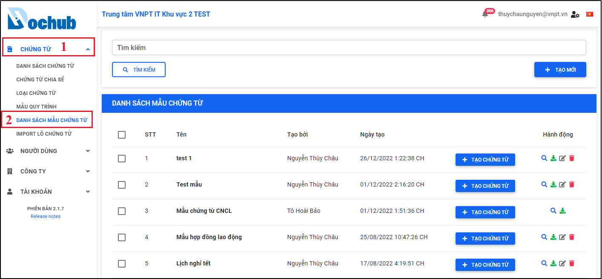

Hình 229: Màn hình quản lý mẫu chứng từ

## 17.1. Tạo mới mẫu chứng từ
- Cho phép người dùng tạo mới mẫu chứng từ trên hệ thống.
- Tại màn hình “Danh sách mẫu chứng từ”, nhấn “Tạo mới” để mở cửa sổ tạo mới mẫu chứng từ, người dùng nhập các thông tin cần thiết và nhấn “Tạo mới” để tạo mới một mẫu chứng từ.

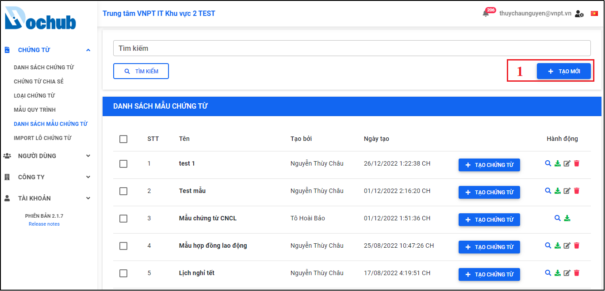

Hình 230: Nhấn "Tạo mới" để mở cửa sổ tạo mới mẫu chứng từ

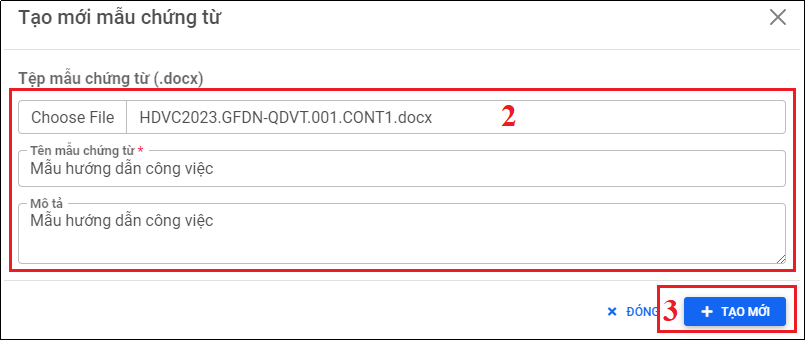

Hình 231: Tải lên tệp mẫu (.docx) và nhập thông tin cần thiết để tạo mới mẫu chứng từ

Hình 232: Thông báo tạo mới mẫu chứng từ thành công

## 17.2. Cập nhật mẫu chứng từ
- Cho phép người dùng cập nhật thông tin mẫu chứng từ trên hệ thống.
- Tại màn hình “Danh sách mẫu chứng từ”, chọn mẫu chứng từ cần cập nhật, nhấn icon “Cập nhật” để mở cửa sổ cập nhật mẫu chứng từ, người dùng thực hiện cập nhật lại các thông tin: Tên mẫu, mô tả, thêm/xóa vị trí ký, Tên và mô tả cho các tham số trong mẫu chứng từ, người dùng nhấn “Lưu” để cập nhật lại thông tin mẫu chứng từ.

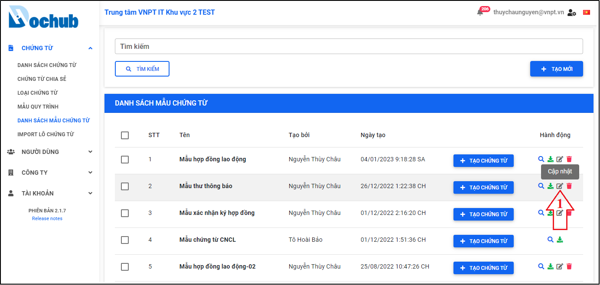

Hình 233: Nhấn icon “Cập nhật” để mở cửa sổ cập nhật mẫu chứng từ

Hình 234: Cập nhật lại các thông tin mẫu chứng từ

Hình 235: Thông báo cập nhật loại chứng từ thành công

## 17.3. Tìm kiếm chứng từ đã tạo từ mẫu chứng từ
- Cho phép người dùng tìm kiếm danh sách các chứng từ đã tạo từ mẫu chứng từ cụ thể.
- Tại màn hình “Danh sách mẫu chứng từ”, chọn mẫu chứng từ cần xem danh sách chứng từ đã tạo, nhấn icon “Tìm chứng từ được tạo từ mẫu này” để mở màn hình danh sách chứng từ được tạo từ mẫu chứng từ đã chọn.

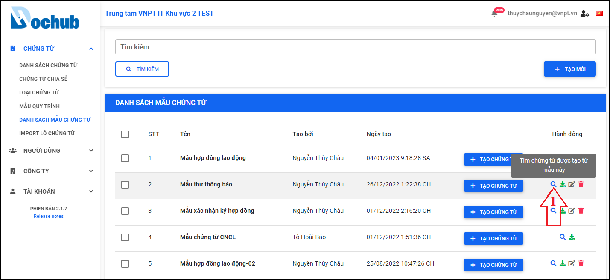

Hình 236: Chọn mẫu chứng từ cần tìm danh sách chứng từ đã tạo

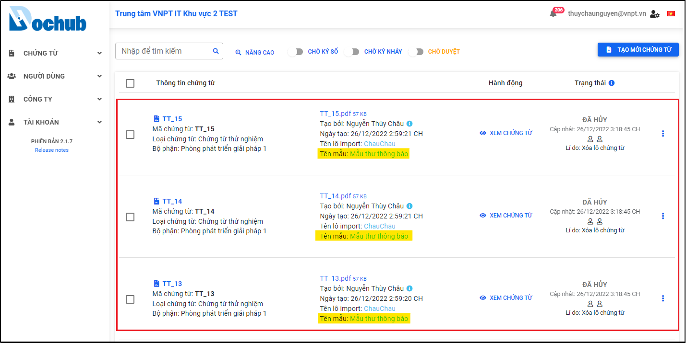

Hình 237: Danh sách chứng từ đã tạo từ mẫu chứng từ đã chọn

## 17.4. Xóa mẫu chứng từ
- Cho phép người dùng xóa mẫu chứng từ khỏi hệ thống.
- Tại màn hình “Danh sách mẫu chứng từ”, chọn mẫu chứng từ cần xóa, nhấn icon “Xóa”, cửa sổ xác nhận xóa mẫu chứng từ xuất hiện, người dùng nhấn “Xác nhận” để thực hiện xóa mẫu chứng từ ra khỏi hệ thống.

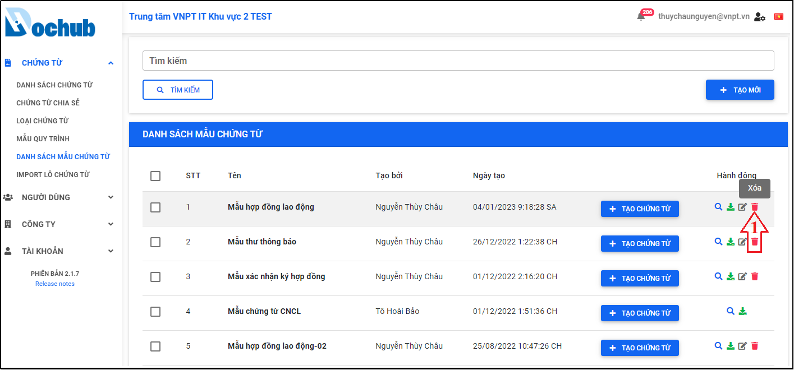

Hình 238: Chọn mẫu chứng từ cần xóa

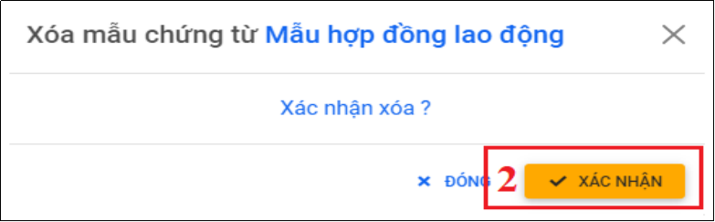

Hình 239: Xác nhận xóa mẫu chứng từ

Hình 240: Thông báo xóa mẫu chứng từ thành công

## 17.5. Tải xuống mẫu chứng từ
- Cho phép người dùng tải xuống mẫu chứng từ có trên hệ thống.
- Tại màn hình “Danh sách mẫu chứng từ”, chọn mẫu chứng từ cần tải, nhấn icon “Tải xuống”, cửa sổ trình quản lý tệp trên máy người dùng sẽ hiển thị, người dùng chọn nơi lưu trữ và nhấn “Save” để lưu tệp mẫu chứng từ về máy.

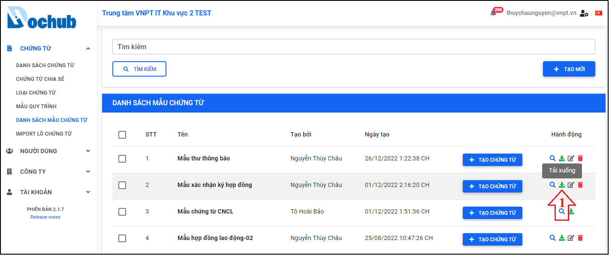

Hình 241: Tính năng tải xuống tệp mẫu chứng từ

## 17.6. Tìm kiếm mẫu chứng từ
- Cho phép người dùng tìm kiếm mẫu chứng từ cụ thể có trên hệ thống.
- Tại màn hình “Danh sách mẫu chứng từ”, nhập tên mẫu chứng từ cần tìm kiếm, nhấn “Tìm kiếm” để thực hiện tìm kiếm mẫu chứng từ có trên hệ thống.

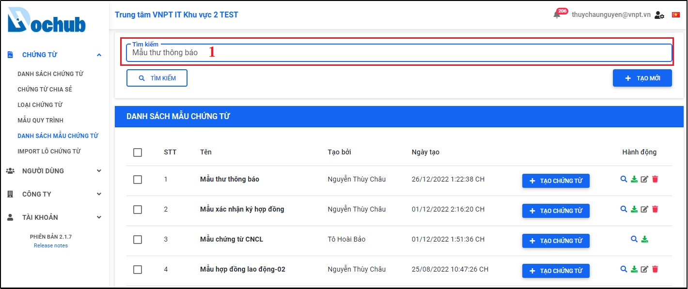

Hình 242: Nhập tên mẫu chứng từ cần tìm kiếm

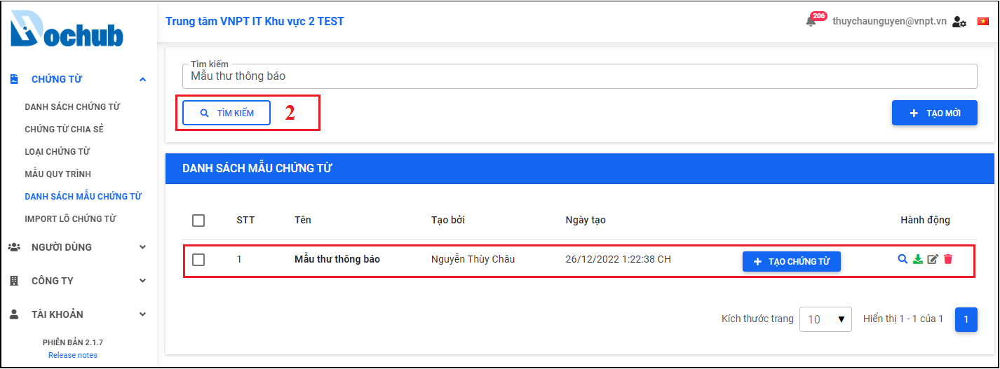

Hình 243: Nhấn “Tìm kiếm” để tìm kiếm mẫu chứng từ cụ thể

## 17.7. Chia sẻ mẫu chứng từ
- Cho phép người dùng chia sẻ một hoặc nhiều mẫu chứng từ do mình tạo ra với một hoặc nhiều người dùng khác có trên hệ thống.
- Tại màn hình “Danh sách mẫu chứng từ”, chọn một hoặc nhiều mẫu chứng từ cần chia sẻ, nút “Chia sẻ mẫu chứng từ” xuất hiện và người dùng nhấn để mở cửa sổ chia sẻ mẫu chứng từ, người dùng thực hiện chọn danh sách người nhận và nhấn “Chia sẻ” để gửi thông báo đến danh sách người nhận đã chọn.

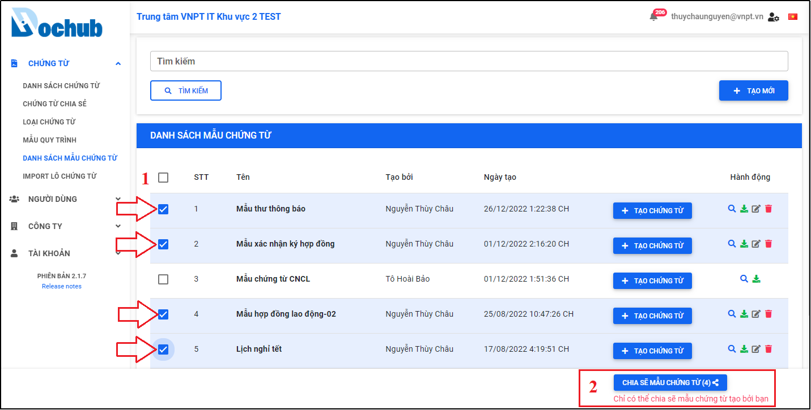

Hình 244: Chọn mẫu chứng từ cần chia sẻ

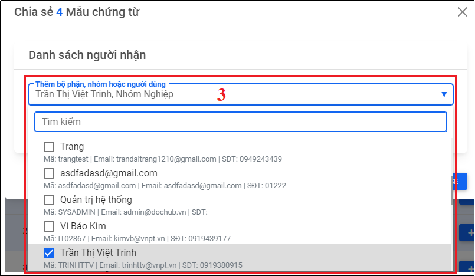

Hình 245: Nhập danh sách người nhận

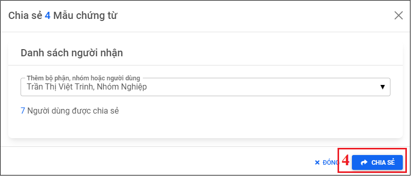

Hình 246: Nhấn "Chia sẻ" để chia sẻ mẫu chứng từ cho danh sách người nhận

Hình 247: Thông báo chia sẻ mẫu chứng từ thành công

## 17.8. Tạo chứng từ từ mẫu
- Cho phép người dùng tạo chứng từ từ mẫu trực tiếp từ màn hình mẫu chứng từ.
- Tại màn hình “Danh sách mẫu chứng từ”, chọn mẫu chứng từ cần tạo chứng từ, nhấn nút “Tạo chứng từ”, màn hình điền các giá trị tham số có trong mẫu chứng từ xuất hiện, người dùng thực hiện điền đầy đủ các giá trị của các tham số, sau đó nhấn “Hoàn tất và tạo chứng từ”, hệ thống sẽ chuyển tiếp sang màn hình “Tạo mới chứng từ” (xem phần hướng dẫn trong phần “Tạo mới chứng từ từ mẫu chứng từ” ở trên).

Hình 248: Tính năng tạo chứng từ từ mẫu

