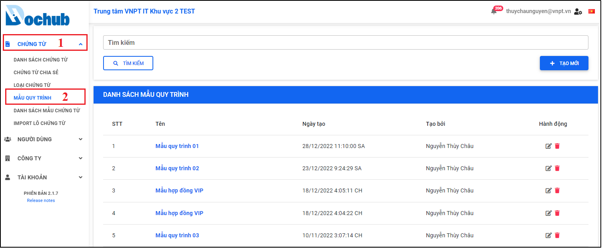

# 16 Quản lý Mẫu quy trình
- Màn hình cho phép người dùng quản lý các mẫu quy trình trên hệ thống như: Tạo mới, Xóa, Cập nhật, Tìm kiếm mẫu quy trình
- Trên menu “Chứng từ” chọn màn hình “Mẫu quy trình”, màn hình quản lý mẫu quy trình xuất hiện.

Hình 217: Màn hình quản lý mẫu quy trình

## 16.1. Tạo mới mẫu quy trình
- Cho phép người dùng tạo mới một mẫu quy trình xử lý chứng từ trên hệ thống.
- Tại màn hình “Mẫu quy trình”, nhấn “Tạo mới” để mở cửa sổ tạo mới mẫu quy trình, người dùng nhập tên mẫu quy trình, thêm người nhận cùng quyền xử lý chứng từ và lựa chọn hoặc sử dụng mặc định các lựa chọn chia sẻ mẫu quy trình này với người khác, xử lý tuần tự chứng từ hay không, người dùng nhấn “Tạo mới” để hoàn tất quá trình tạo mới mẫu quy trình.

Hình 218: Nhấn "Tạo mới" để mở cửa sổ tạo mới mẫu quy trình

Hình 219: Nhập tên và thêm người nhận trong mẫu quy trình

Hình 220: Thông báo tạo mới mẫu quy trình thành công

## 16.2. Cập nhật mẫu quy trình
-Cho phép người dùng cập nhật thông tin mẫu quy trình trên hệ thống.
-Tại màn hình “Mẫu quy trình”, chọn mẫu quy trình cần cập nhật, nhấn icon “Cập nhật” để mở cửa sổ cập nhật mẫu quy trình, người dùng thực hiện cập nhật lại các thông tin và nhấn “Lưu” để cập nhật lại thông tin mẫu quy trình.

Hình 221: Nhấn icon “Cập nhật” để mở cửa sổ cập nhật mẫu quy trình

Hình 222: Cập nhật lại các thông tin mẫu chứng từ

Hình 223: Thông báo cập nhật mẫu quy trình thành công

## 16.3. Xóa mẫu quy trình
-Cho phép người dùng xóa mẫu quy trình khỏi hệ thống.
-Tại màn hình “Mẫu quy trình”, chọn loại chứng từ cần xóa, nhấn icon “Xóa”, cửa sổ xác nhận xóa mẫu quy trình xuất hiện, người dùng nhấn “Xác nhận” để thực hiện xóa mẫu quy trình ra khỏi hệ thống.

Hình 224: Chọn mẫu quy trình cần xóa

Hình 225: Xác nhận xóa mẫu quy trình

Hình 226: Thông báo xóa loại chứng từ thành công

## 16.4. Tìm kiếm mẫu quy trình
-Cho phép người dùng tìm kiếm mẫu quy trình cụ thể bằng Tên mẫu quy trình có trên hệ thống.
-Tại màn hình “Mẫu quy trình”, nhập tên mẫu quy trình cần tìm kiếm, nhấn “Tìm kiếm” để thực hiện tìm kiếm mẫu quy trình.

Hình 227: Nhập tên mẫu quy trình cần tìm kiếm

Hình 228: Nhấn “Tìm kiếm” để tìm kiếm mẫu quy trình cụ thể
