# 3. Quản lý tài khoản
Tính năng cho phép người dùng cập nhật các thông tin cá nhân: 
* Đổi mật khẩu
* Cập nhật thông tin cá nhân
* Cập nhật hình ảnh chữ ký
* Cập nhật tài khoản VNPT SmartCA

Có 3 cách để mở màn hình “Quản lý tài khoản”:
* Tại trang chủ chọn “Quản lý tài khoản”:
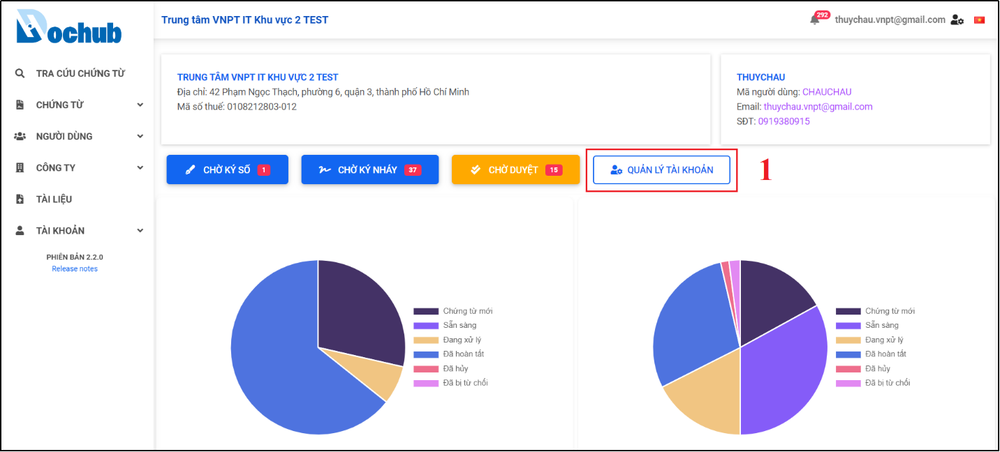

Hình 9: Mở màn hình "Quản lý tài khoản” ngay trên trang chủ DocHub.

  * Nhấn vào tài khoản bên góc phải trên cùng màn hình, nhấn chọn “Quản lý tài khoản”:

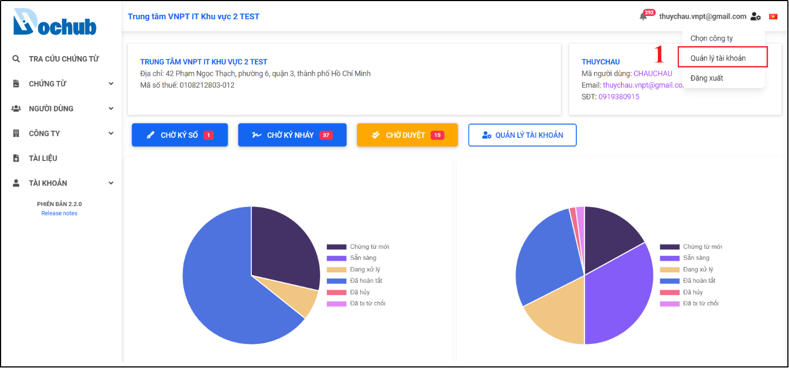

Hình 10: Mở màn hình "Quản lý tài khoản” cách 2.

  * Chọn menu Tài khoản trên thanh menu bên trái màn hình => chọn “Quản lý tài khoản”

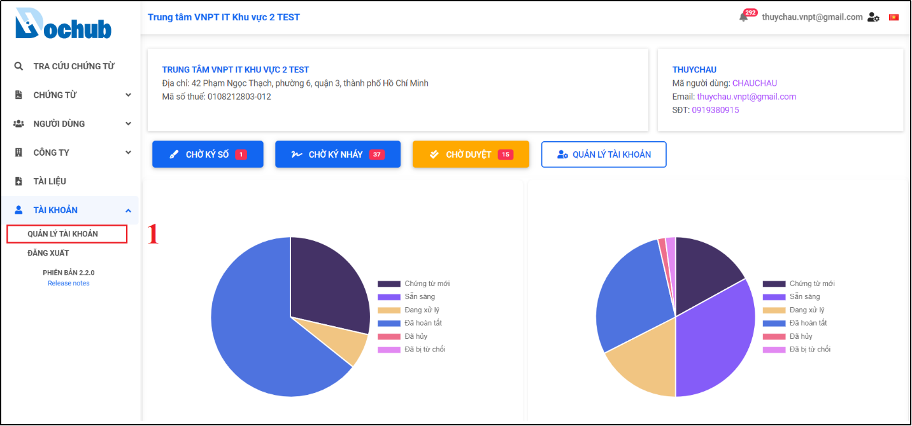

Hình 11: Mở màn hình "Quản lý tài khoản" trong menu Tài khoản

## 3.1. Đổi mật khẩu
* Chức năng cho phép người dùng đổi mật khẩu mới.
* Trên màn hình “Quản lý tài khoản”, người dùng nhấn nút “Đổi mật khẩu”, cửa sổ “Đổi mật khẩu” hiện ra. Người dùng nhập mật khẩu, mật khẩu mới và nhập lại mật khẩu xác nhận, sau đó nhấn nút “Đổi mật khẩu” để hoàn tất.
* Tại màn hình “Thông tin tài khoản”, Nhấn “Đổi mật khẩu” để mở cửa sổ và thực hiện đổi tài khoản:

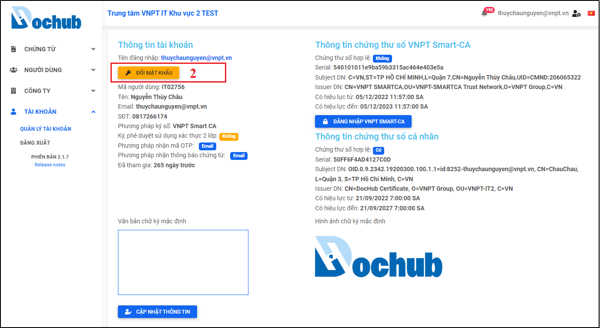

Hình 12: Sử dụng tính năng "Đổi mật khẩu"

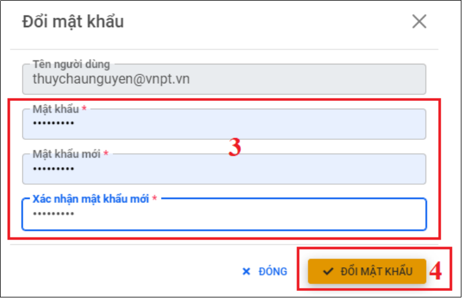

Hình 13: Nhập lại mật khẩu và xác nhận mật khẩu mới

## 3.2. Cập nhật thông tin cá nhân
- Chức năng cho phép người dùng cập nhật các thông tin cá nhân, bao gồm:
  * Họ và tên
  * SĐT
  * Email
  * Mã số thuế
  * Địa chỉ
  * Bật/Tắt xác thực 2 lớp khi xử lý chứng từ (Phê duyệt/ký nháy)
  * Phương pháp nhận mã OTP: Email/SMS
  * Phương pháp nhận thông báo chứng từ: Email/SMS
  * Phương pháp ký số: VNPT SmartCA, USB Token
  * Văn bản chữ ký mặc định

- Lưu ý: Tùy vào cấu hình của từng công ty, sẽ cho phép hoặc không cho phép người dùng tự cập nhật nhật thông tin email và SĐT cá nhân.
- Tại màn hình “Quản lý tài khoản”, nhấn “Cập nhật thông tin” để mở cửa sổ và thực hiện cập nhật các thông tin cần thiết:
  

Hình 14: Mở cửa sổ "Cập nhật thông tin"

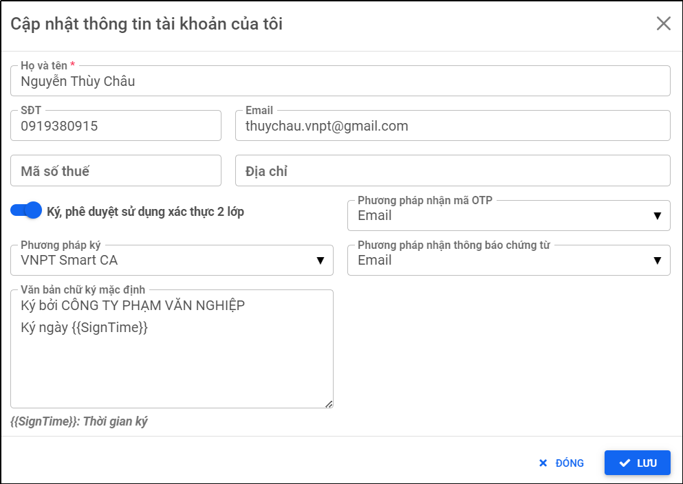

Hình 15: Trường hợp cấu hình cho phép người dùng có thể cập nhật Email, SĐT

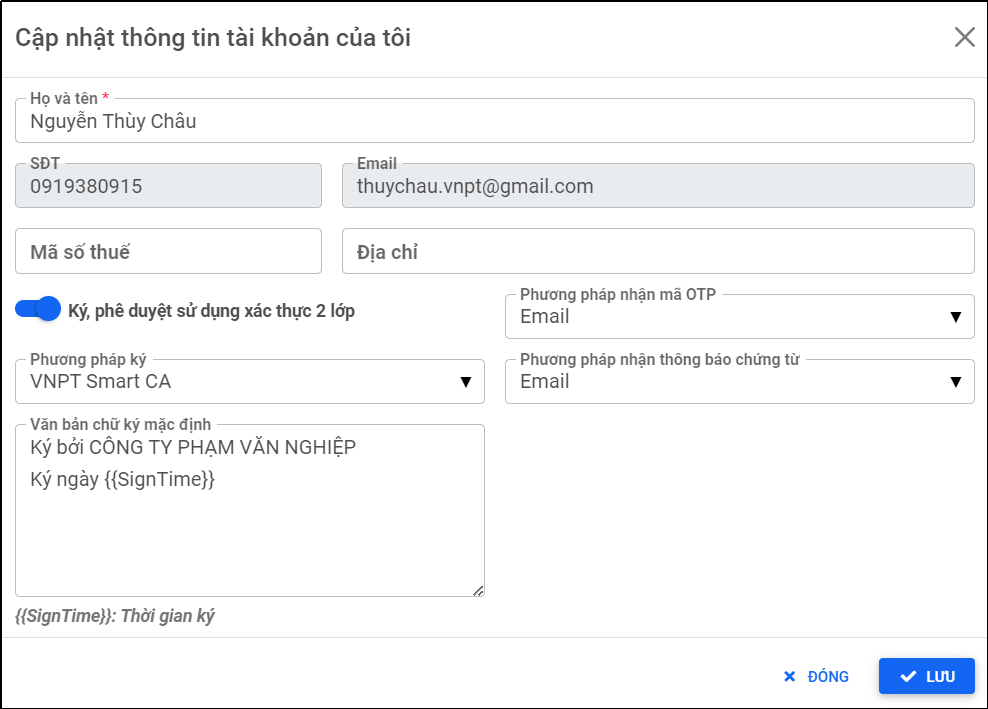

Hình 16: Trường hợp không cho phép người dùng tự cập nhật thông tin email, SĐT cá nhân

Cập nhật thông tin cần thiết và nhấn “Lưu” để xác nhận các thông tin người dùng vừa cập nhật, thông báo cập nhật người dùng thành công:

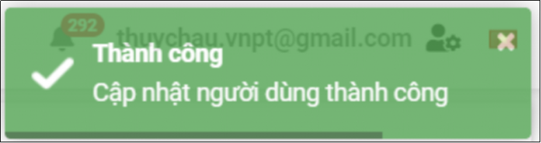

Hình 17: Thông báo cập nhật thành công khi nhấn "Lưu"

## 3.3. Cập nhật hình ảnh chữ ký
- Chức năng cho phép người dùng cập nhật hình ảnh chữ ký cá nhân, hình ảnh con dấu doanh nghiệp, hoặc vẽ hình ảnh chữ ký mặc định khi thực hiện xử lý chứng từ, có 2 cách tạo hình ảnh chữ ký:
    * Tạo hình ảnh chữ ký mới:
        * Tải lên hình ảnh chữ ký hoặc hình ảnh con dấu doanh nghiệp
        * Vẽ trực tiếp hình ảnh chữ ký
- Chọn từ hình ảnh chữ ký đã lưu (Trường hợp người dùng đã lưu thay đổi nhiều hình ảnh chữ ký trước đó)

Hình 18: Mở cửa sổ “Cập nhật hình chữ ký”

Thực hiện cập nhật hình ảnh chữ ký mặc đình và nhấn “Lưu” để xác nhận các thay đổi:
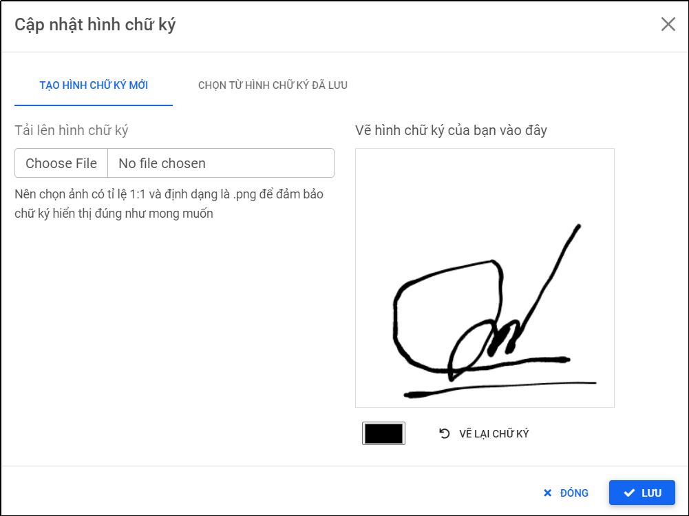

Hình 19: Vẽ hình ảnh chữ ký trực tiếp

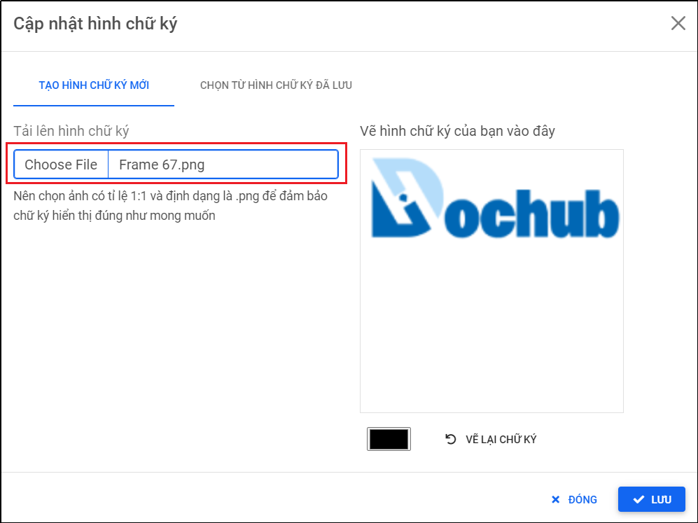

Hình 20: Tải lên hình ảnh chữ ký hoặc con dấu doanh nghiệp

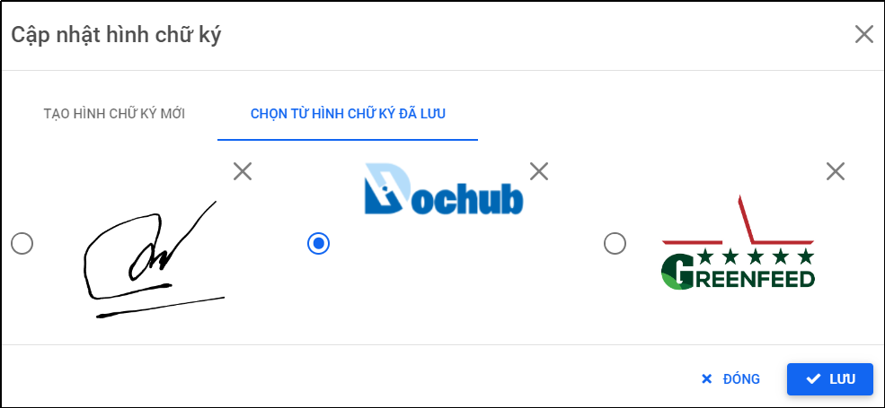

Hình 21: Sử dụng hình ảnh chữ ký đã lưu trước đó

Nhấn “Lưu” để xác nhận thay đổi hình ảnh chữ ký:

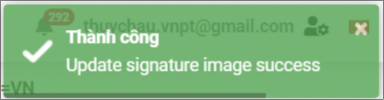

Hình 22: Cập nhật hình ảnh chữ ký thành công

## 3.4. Cập nhật tài khoản VNPT SmartCA
- Chức năng cho phép người dùng cập nhật tài khoản VNPT SmartCA, bao gồm tài khoản SmartCA cá nhân và tài khoản SmartCA doanh nghiệp:
  
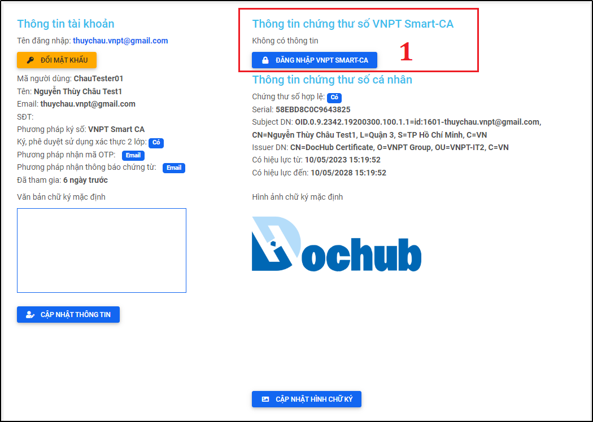

Hình 23: Mở cửa sổ "Đăng nhập VNPT SmartCA" để thực hiện cập nhật tài khoản SmartCA

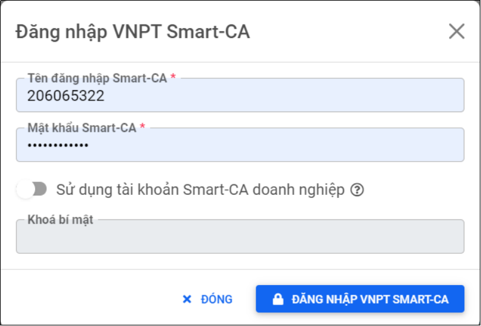

Hình 24: Thực hiện cập nhật tài khoản SmartCA cá nhân

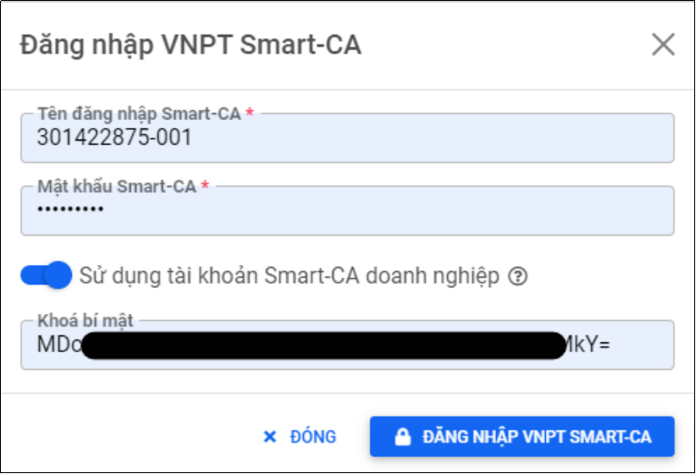

Hình 25: Cập nhật tài khoản VNPT SmartCA doanh nghiệp
