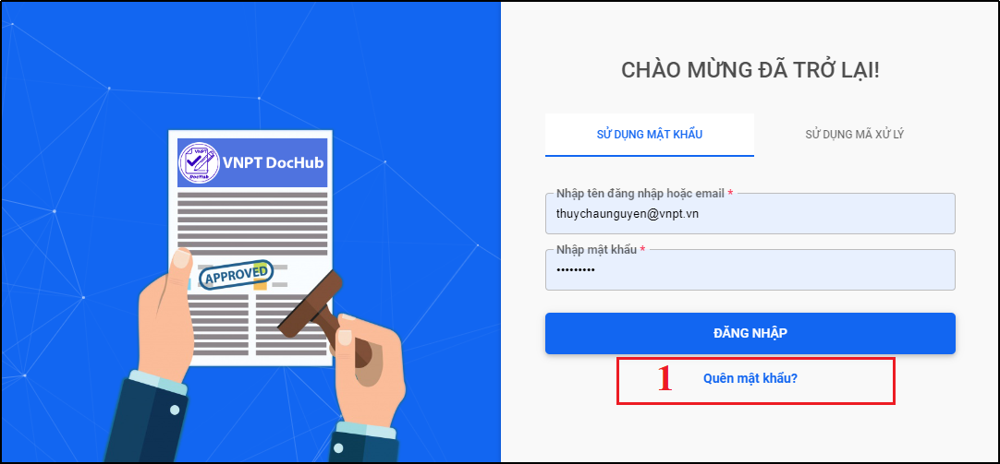
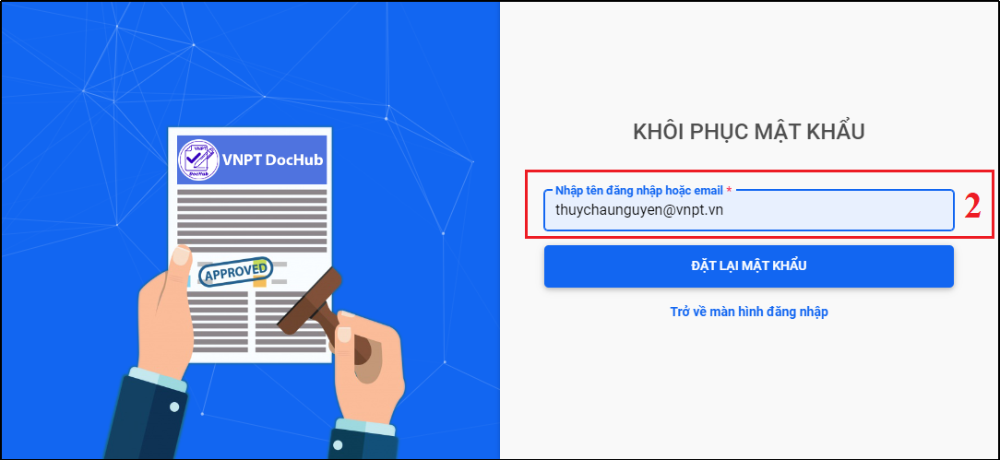
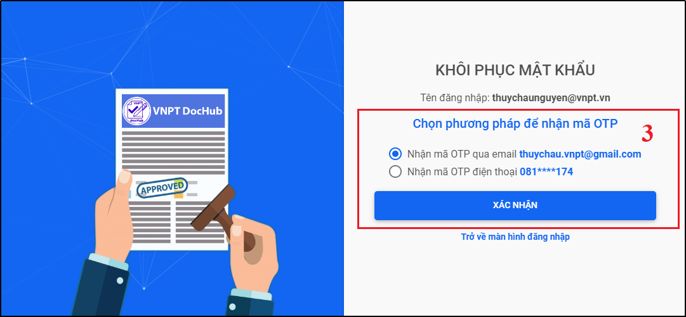
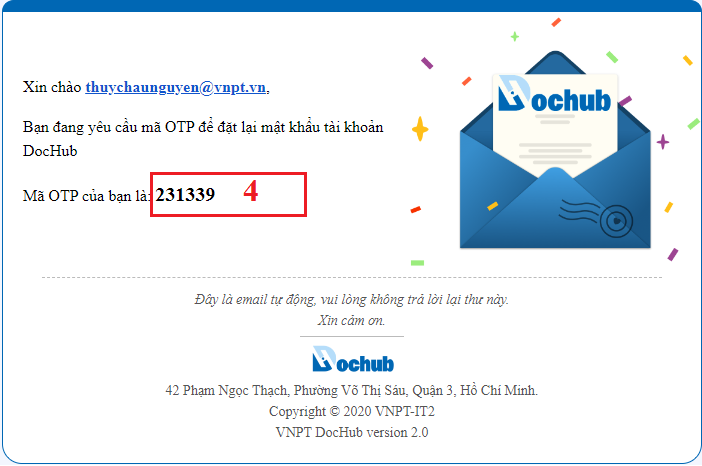
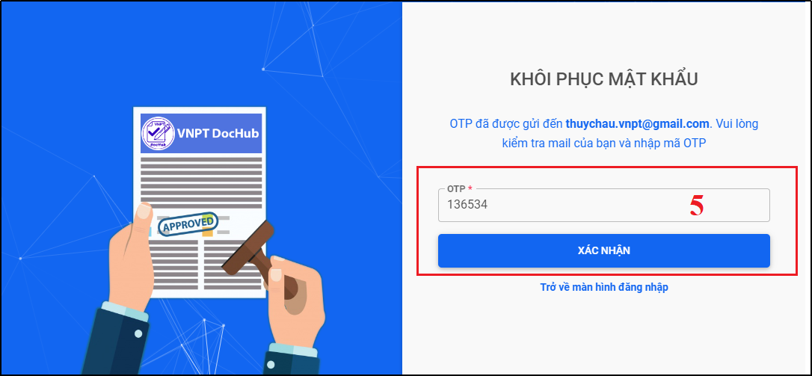
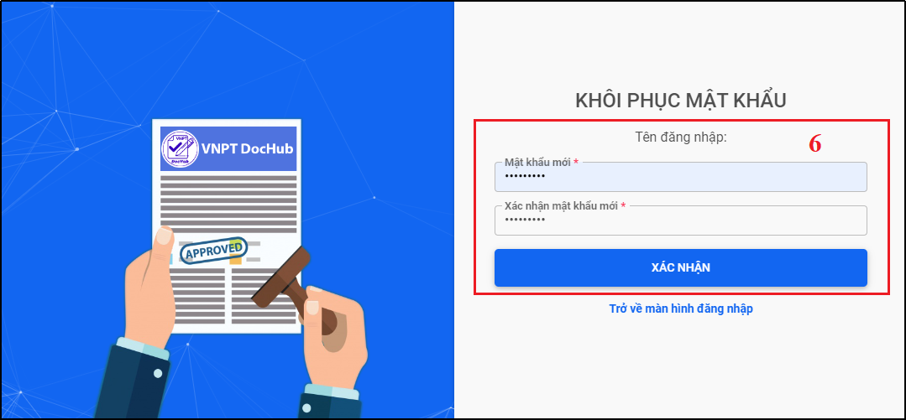
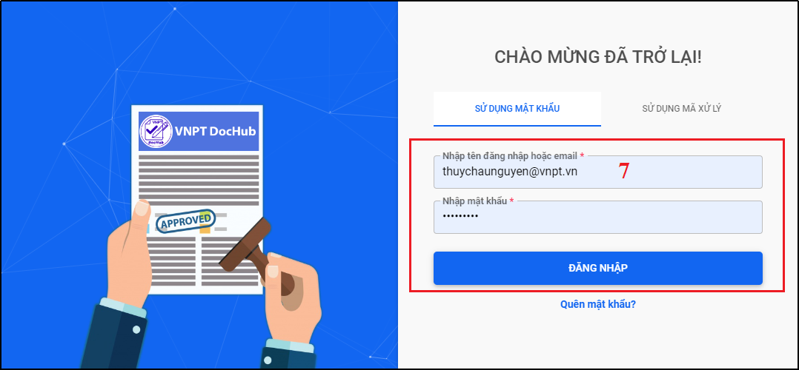

# 2.Quên mật khẩu
* Chức năng cho phép người dùng lấy lại mật khẩu đã quên.
* Trên màn hình đăng nhập, người dùng nhấn nút “Quên mật khẩu” màn hình khôi phục mật khẩu hiện ra. Người dùng nhập tên đăng nhập hoặc email, nhấn “Đặt lại mật khẩu”, người dùng chọn phương pháp nhận mã OTP để khôi phục mật khẩu mới, người dùng đặt lại mật khẩu mới và sử dụng mật khẩu vừa tạo để đăng nhập vào hệ thống.

Hình 2: Màn hình đăng nhập hệ thống 

Hình 3: Tính năng Quên mật khẩu

Hình 4: Chọn phương pháp nhận mã xác nhận OTP

Hình 5: Mã OTP được gửi qua email

Hình 6: Nhập mã OTP vào cửa sổ khôi phục mật khẩu

Hình 7: Tạo mật khẩu mới cho tài khoản

Hình 8: Đăng nhập vào hệ thống bằng mật khẩu vừa khôi phục
