# 6. Tạo mới chứng từ
Tính năng cho phép người dùng tạo mới chứng từ từ 3 loại file: 
 * Tạo mới chứng từ bằng cách upload tệp tin
 * Tạo mới chứng từ từ chứng từ mẫu
 * Tạo mới chứng từ hàng loạt (nhiều) bằng lô import
## 6.1. Tạo mới một chứng từ upload tệp tin
Tạo chứng từ upload tệp tin là tính năng sử dụng tải lên file (.pdf, .docx) được lưu ở local máy tính để tạo chứng từ xử lý trên hệ thống DocHub. Để thực hiện tạo mới một chứng từ, người dùng cần có tài khoản và đăng nhập vào màn hình Danh sách chứng từ của hệ thống DocHub (Xem hướng dẫn phần đăng nhập mục 1), các bước để tạo mới một chứng từ:
* **Bước 1: Tạo chứng từ**
  
Tại màn hình trang chủ, nhấn vào menu “Chứng từ” > “Danh sách chứng từ” để mở màn hình danh sách chứng từ và thực hiện tạo mới chứng từ:

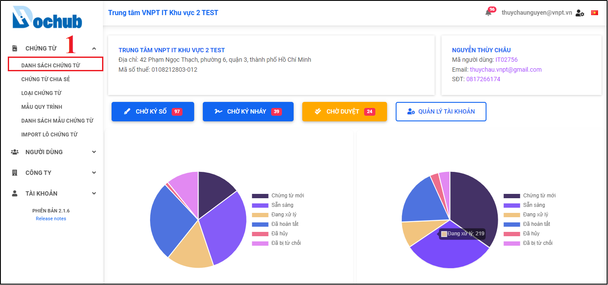

Hình 40: Màn hình trang chủ hệ thống DocHub

Hình 41: Màn hình Danh sách chứng từ

Hình 42: Màn hình tạo mới một chứng từ

Tại màn hình tạo mới một chứng từ này, người dùng thực hiện chọn và nhập các thông tin của chứng từ, các trường bắt buộc bao gồm:
* Tệp chứng từ (.pdf, .docx) 
* Mã chứng từ
* Tiêu đề chứng từ

Một số trường thông tin không bắt buộc khác, tuy nhiên để tiện cho việc tìm kiếm, thống kê báo cáo sau này, người dùng có thể bổ sung đầy đủ các thông tin khác của chứng từ bao gồm: 
* Loại chứng từ
* Bộ phận
* Ngày hết hạn xử lý
* Mã khách hàng
* Thông tin khách hàng
* Giá trị hợp đồng
* Ngày hiệu lực (Từ ngày - Đến ngày)
* Mô tả
* Tải thêm tệp đính kèm hoặc chọn các chứng từ liên quan đã có trên hệ thống

Ngoài ra, người dùng có thể sử dụng tính năng tự tạo mã và tiêu đề chứng từ tự động của hệ thống , tuy nhiên để sử dụng được tính năng này, người dùng cần có sẵn “Loại chứng từ” và “Bộ phận”. Quy tắc mã và tiêu đề chứng từ tự tạo của hệ thống như sau:
* Mã chứng từ: **[Mã Bộ phận].[Mã Loại chứng từ].[Thời gian YYYY-MM-DD].[Mã ngẫu nhiên]:**
  * Ví dụ: PTGP1.TEST.20221218.K3B
* Tiêu đề chứng từ: **[Chứng từ Mã Bộ phận].[Mã Loại chứng từ].[Thời gian YYYY-MM-DD].[Mã ngẫu nhiên]:**
  * Ví dụ: Chứng từ PTGP1.TEST.20221218.K3B

Sau khi điền và tải lên tệp chứng từ, nhấn “Lưu và tiếp tục” để thực hiện bước tiếp theo:

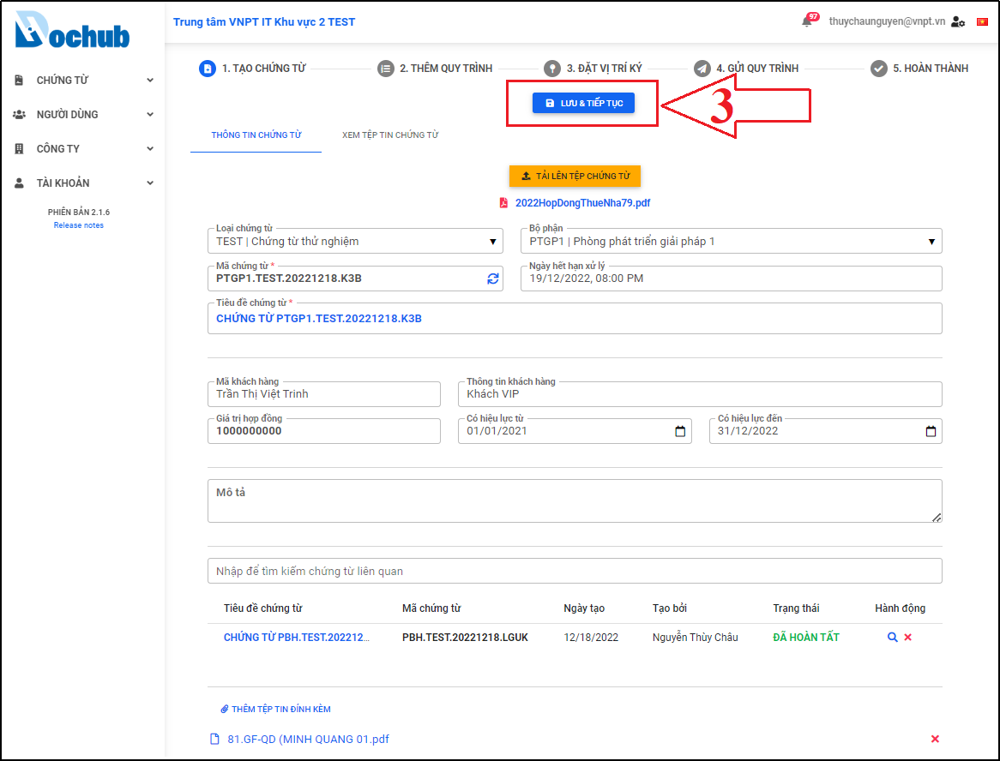

Hình 43: Tạo các thông tin chứng từ

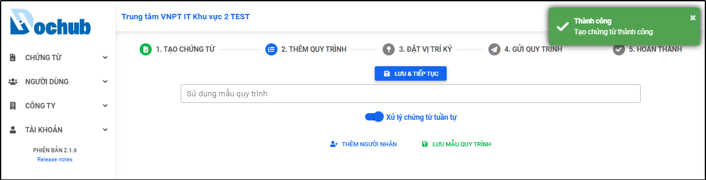

Hình 44: Thông báo bước 1 tạo chứng từ thành công

* **Bước 2: Thêm quy trình người nhận chứng từ**
  
Tại bước này, người dùng có thể sử dụng mẫu quy trình có sẵn trên hệ thống bằng cách nhập tên mẫu quy trình vào thanh tìm kiếm “Sử dụng mẫu quy trình”, hoặc có thể tạo mới mẫu quy trình bằng cách: nhấn “Thêm người nhận” để thực hiện thêm người vào quy trình xử lý chứng từ. Tại đây người tạo chứng từ có thể chọn “Xử lý chứng từ tuần tự” hoặc không, mặc định hệ thống sẽ xử lý chứng từ tuần tự:

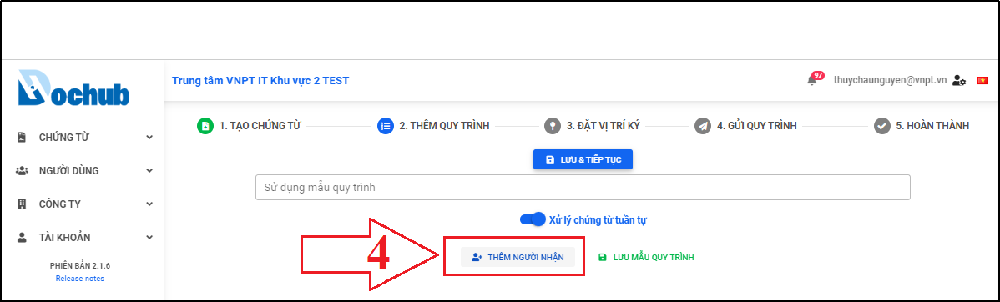

Hình 45: Thêm mới người nhận

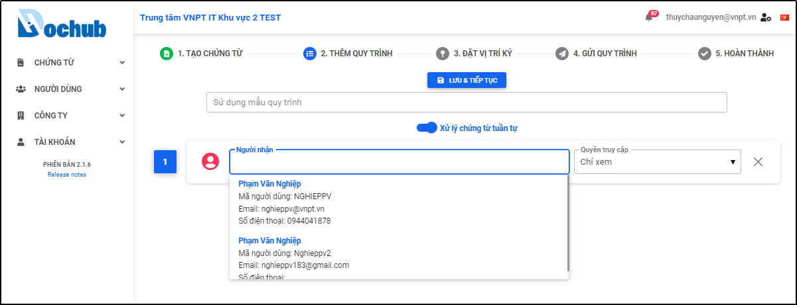

Hình 46: Chọn người nhận có trên hệ thống để thêm vào quy trình xử lý chứng từ

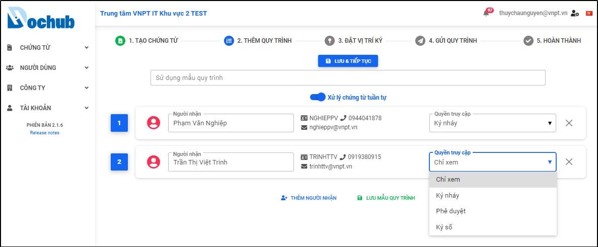

Hình 47: Chọn quyền xử lý chứng từ cho người nhận

Ngoài ra, tại bước này người tạo chứng từ có thể lưu mẫu quy trình này lại để sử dụng cho những lần tạo chứng từ tiếp theo, bằng cách nhấn **“Lưu mẫu quy trình”**, nhập tên mẫu quy trình và nhấn **“Lưu”**

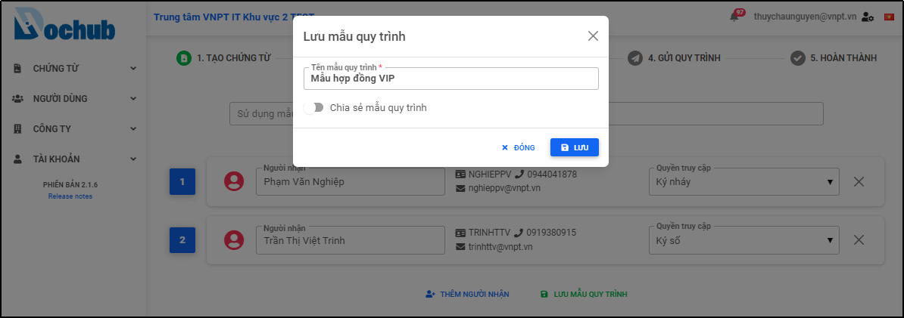

Hình 48: Lưu lại mẫu quy trình

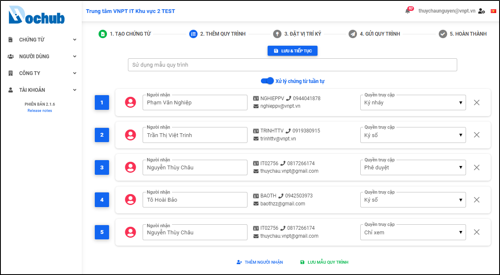

Hình 49: Hoàn thành bước thêm quy trình người nhận chứng từ

Hình 50: Thông báo cập nhật chứng từ thành công và chuyển sang bước tiếp theo

* **Bước 3: Đặt vị trí ký (nếu có)**
  
Tại bước này, người dùng thực hiện đặt vị trí ký trước cho người nhận chứng từ, trường hợp không đặt vị trí ký có thể bỏ qua bước này. Để đặt vị trí ký, chọn vùng ký và di duyển đến vị trí mong muốn. Sau khi thực hiện xong nhấn “Lưu và tiếp tục” để đến bước cuối cùng:

Hình 51: Đặt vị trí ký và sang bước tiếp theo

* **Bước 4: Gửi quy trình và hoàn thành tạo mới chứng từ**
  
Nhấn “Gửi quy trình” để gửi thông báo xử lý chứng từ cho những người trong quy trình và hoàn tất quy trình tạo một chứng từ:

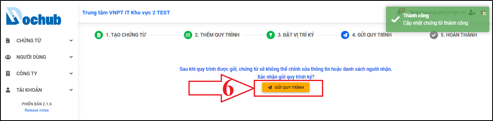

Hình 52: Gửi quy trình xử lý chứng từ cho những người nhận

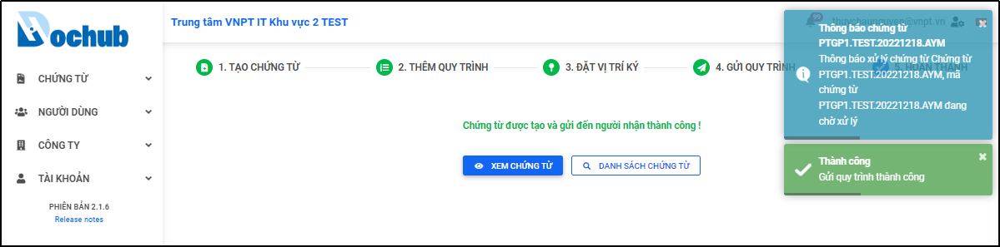

Hình 53: Thông báo gửi quy trình thành công và hoàn thành tạo mới một chứng từ

## 6.2. Tạo mới một chứng từ từ mẫu chứng từ 
Tạo chứng từ từ mẫu chứng từ là sử dụng tính năng tạo chứng từ trong màn hình Danh sách mẫu chứng từ để chuyển từ file mẫu chứng từ (.docx) thành file chứng từ (.pdf). Để thực hiện tạo mới một chứng từ từ mẫu chứng từ, người dùng cần có tài khoản và đăng nhập vào màn hình Danh sách mẫu chứng từ của hệ thống DocHub, các bước để tạo mới một chứng từ:

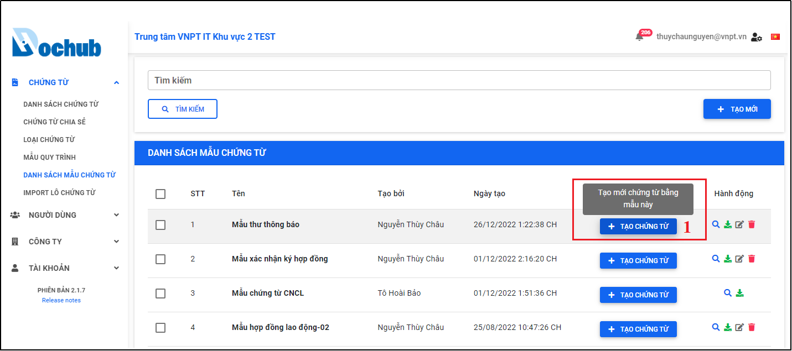

Hình 54: Vào màn hình “Danh sách mẫu chứng từ” và Chọn mẫu cần tạo chứng từ

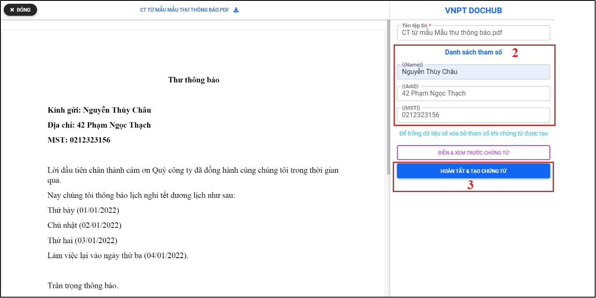

Hình 55: Điền giá trị các tham số và nhấn "Hoàn tất & Tạo chứng từ"

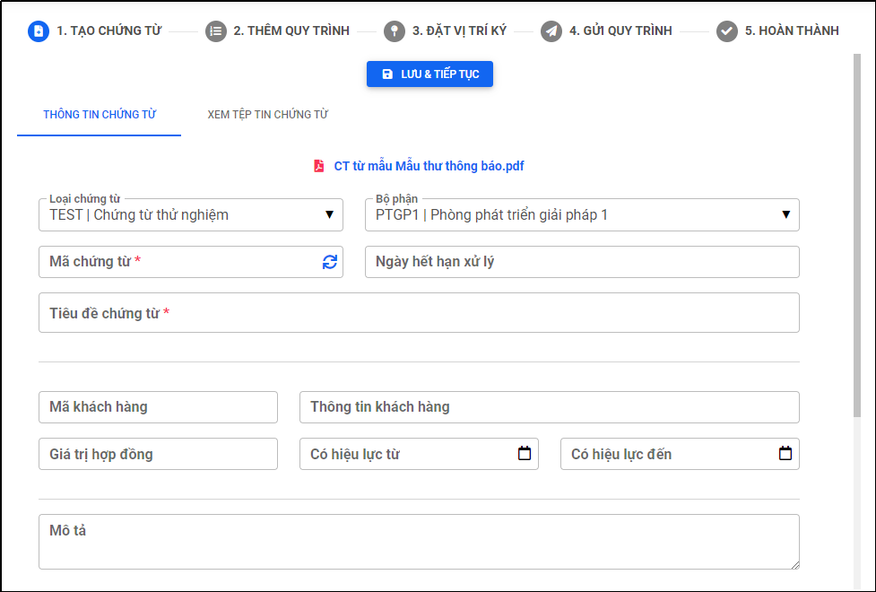

Hình 56: Màn hình tạo mới chứng từ xuất hiện

- Tại đây, người dùng thực hiện điền thông tin chứng từ, thêm quy trình xử lý chứng từ, Đặt vị trí ký và Gửi quy trình sau khi tạo xong tương tự như các tạo mới chứng từ từ file PDF (xem hướng dẫn mục “Tạo mới một chứng từ từ file PDF)
## 6.3. Import lô chứng từ (Tạo hàng loạt chứng từ có sẵn template)
Để thực hiện tạo mới lô import (hàng loạt) chứng từ, người dùng cần có tài khoản và đăng nhập vào màn hình Import lô chứng từ của hệ thống DocHub, các bước để tạo mới lô chứng từ:
* **Bước 1: Truy cập vào màn hình Import lô chứng từ**
  
Tại màn hình trang chủ, người dùng truy cập “Chứng từ” > “Import lô chứng từ” để truy cập vào màn hình danh sách lô chứng từ: 

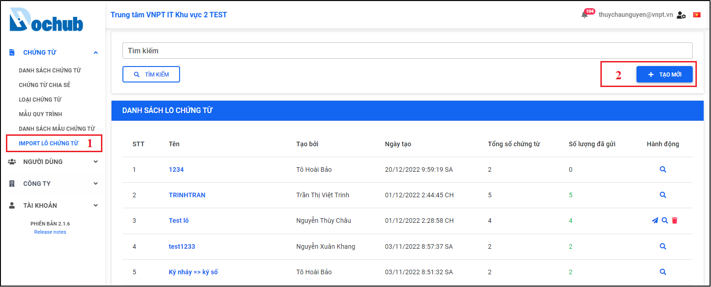

Hình 57: Màn hình Import lô chứng từ

* **Bước 2: Mở cửa sổ Import lô chứng từ**
  
Tại màn hình danh sách Import lô chứng từ (bước 1), nhấn chọn nút **“Tạo mới”**, Cửa sổ **“Import lô chứng từ”** xuất hiện và người dùng thực hiện cập nhật đầy đủ các thông tin cần thiết để import lô chứng từ. 

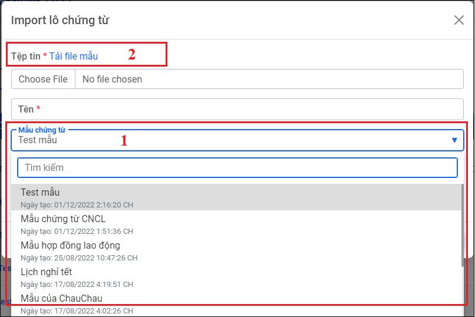

Hình 58: Cửa sổ Import lô chứng từ

* **Bước 3: Chọn mẫu chứng từ và Tải xuống file mẫu import lô chứng từ**
  
Hệ thống sẽ tự động tạo file mẫu lô chứng từ tương ứng với mẫu chứng từ mà người dùng chọn (Hình số 1 Cửa số import lô chứng từ). Thực hiện tải xuống file mẫu excel import lô chứng từ bằng cách nhấn vào tính năng “Tải file mẫu”.

Người dùng thực hiện cập nhật các thông tin cần thiết cho từng chứng từ, mỗi chứng từ là một hàng (tương tự cho từng chứng từ), sau đó tải lên file vừa cập nhật thông qua trường “Tệp tin” trên cửa số import lô chứng từ.

Các thông tin cơ bản của chứng từ:
Tên file chứng từ (Được phép trùng nhưng khuyến cáo đặt tên khác nhau)
* Mã chứng từ (bắt buộc)
* Tiêu đề chứng từ (bắt buộc - Được phép trùng nhưng khuyến cáo đặt tiêu đề khác nhau)
* Ngày hết hạn (Định dạng dd/mm/yyyy)
* Mô tả

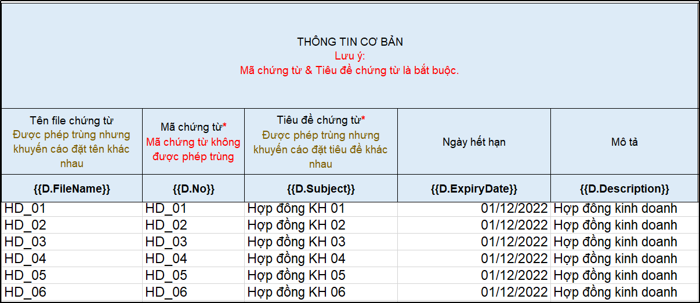

Hình 59: Thông tin cơ bản của các chứng từ trong lô

Thông tin quy trình ký:
* Xử lý tuần tự hay không? (Y: có, N: không)
* Người nhận thứ 1
* Quyền truy cập của người nhận thứ 1
* Người nhận thứ n
* Quyền truy cập của người nhận thứ n
Lưu ý phần thông tin quy trình ký: 
* Toàn bộ chứng từ phải có quy trình ký với số người nhận bằng nhau. 
* Nếu số người nhận khác nhau, vui lòng tách thành nhiều lần tạo hàng loạt khác nhau.
* Không được để trống bất kỳ cột người nhận/ quyền truy cập nào.
* Nếu cột "Xử lý tuần tự?" để trống thì hệ thống mặc định xử lý không tuần tự.

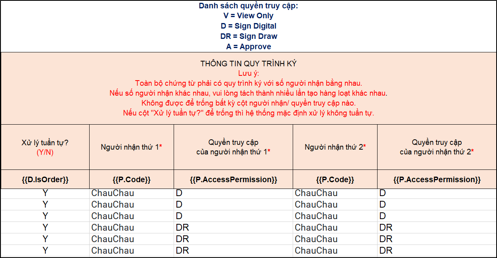

Hình 60: Thông tin quy trình ký trong lô chứng từ

Thông tin giá trị các tham số trên chứng từ: Hệ thống tự động tạo file mẫu với các tham số tương ứng với mẫu chứng từ mà người dùng chọn (ở bước 2), người dùng thực hiện điền đầu đủ các giá trị của các tham số vào file import lô chứng từ:

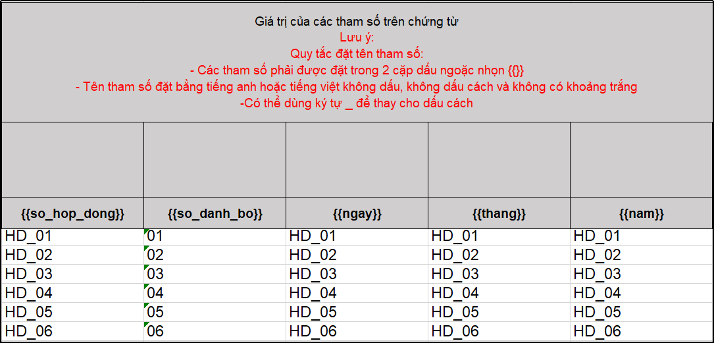

Hình 61: Thông tin các tham số trong lô chứng từ

File mẫu lô chứng từ sau khi hoàn tất cập nhật:

Hình 62: File mẫu import lô chứng từ

* **Bước 4: Cập nhật thông tin cửa sổ import lô chứng từ**

Sau khi người dùng đã tải lên lại file import đã cập nhật lên cửa sổ import lô chứng từ, tiếp theo thực hiện cập nhật các thông tin có trên cửa sổ import lô chứng từ như:
* Tải lên file import đã cập nhật (bước 3)
*Tên (Bắt buộc)
* Mẫu chứng từ (Đã chọn ở bước 3)
* Loại chứng từ
* Bộ phận

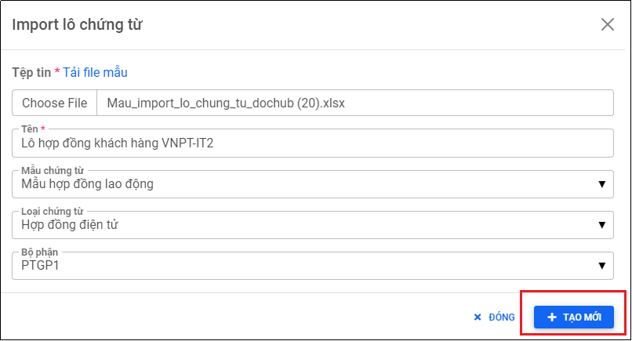

Hình 63: Cập nhật đầy đủ thông tin import lô chứng từ

* **Bước 5: Import và gửi lô chứng từ**

Sau khi hoàn thành cập nhật đầy đủ các thông tin trong cửa sổ Import lô chứng từ, người dùng thực hiện nhấn nút “Tạo mới” để import hàng loạt chứng từ vào hệ thống DocHub và gửi qui trình xử lý chứng từ cho những người nhận:

Hệ thống thông báo import lô chứng từ thành công sau khi tạo mới lô chứng từ:

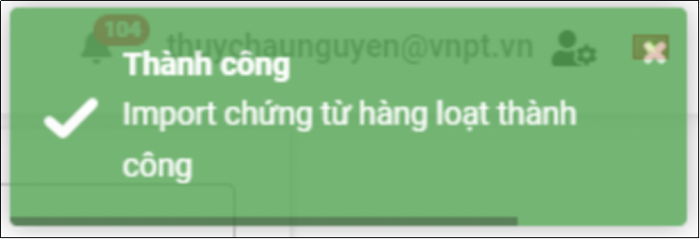

Hình 64: Import lô chứng từ thành công

Nhấn nút “Gửi quy trình” để thực hiện gửi quy trình xử lý cho những người nhận trong lô chứng từ:

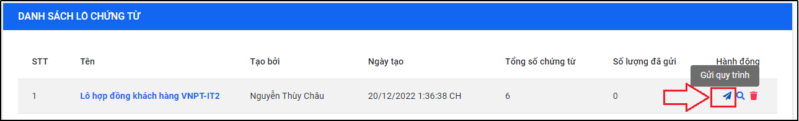

Hình 65: Màn hình danh sách lô chứng từ sau khi import thành công

Kiểm tra và nhấn “Xác nhận” để hoàn tất gửi quy trình hàng loạt cho lô chứng từ:

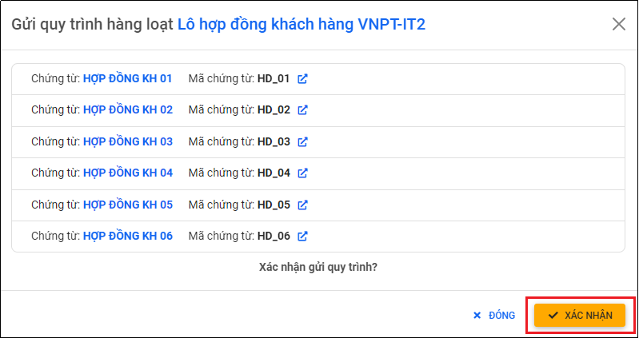

Hình 66: Màn hình xác nhận gửi quy trình lô chứng từ

Thông báo gửi quy trình hàng loạt cho lô chứng từ thành công:

Hình 67: Thông báo gửi quy trình thành công
