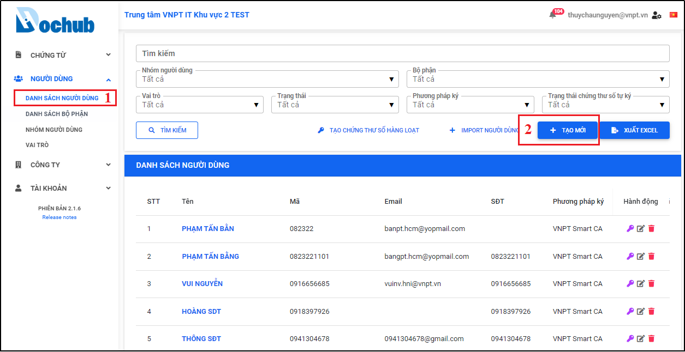
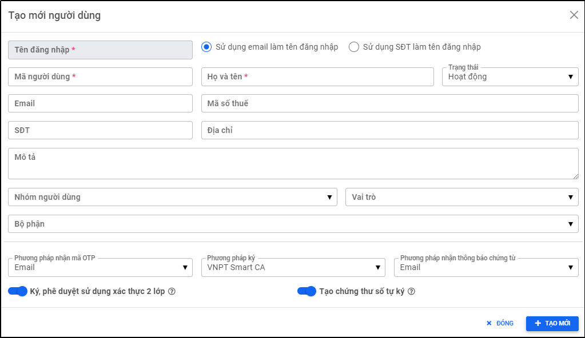
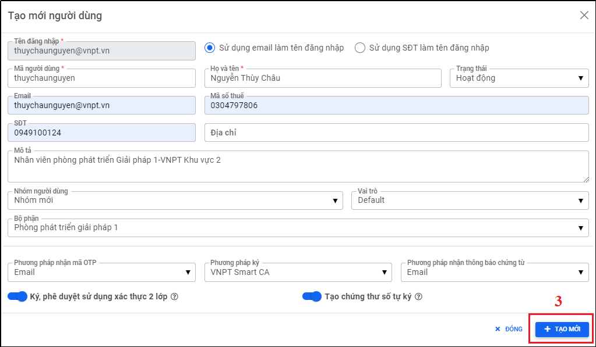
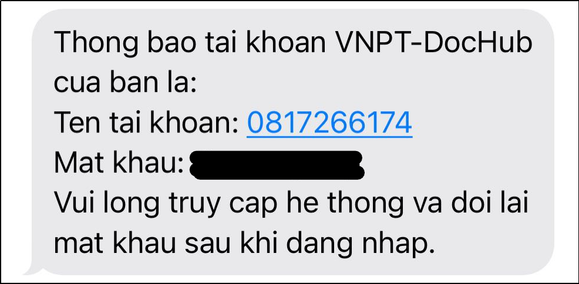
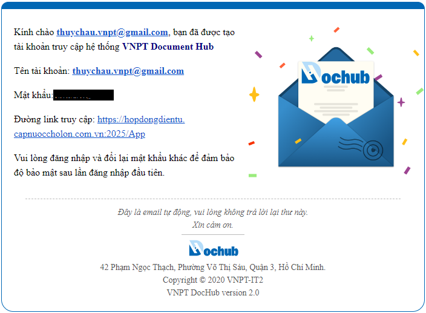
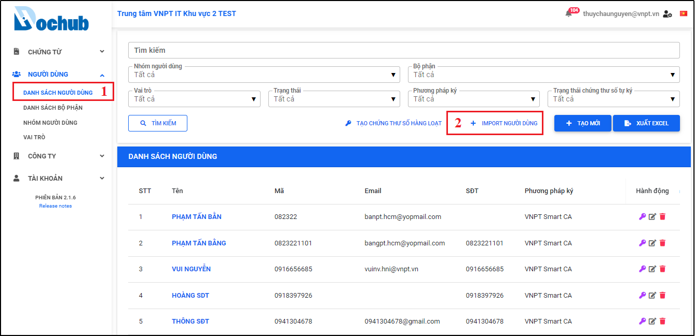
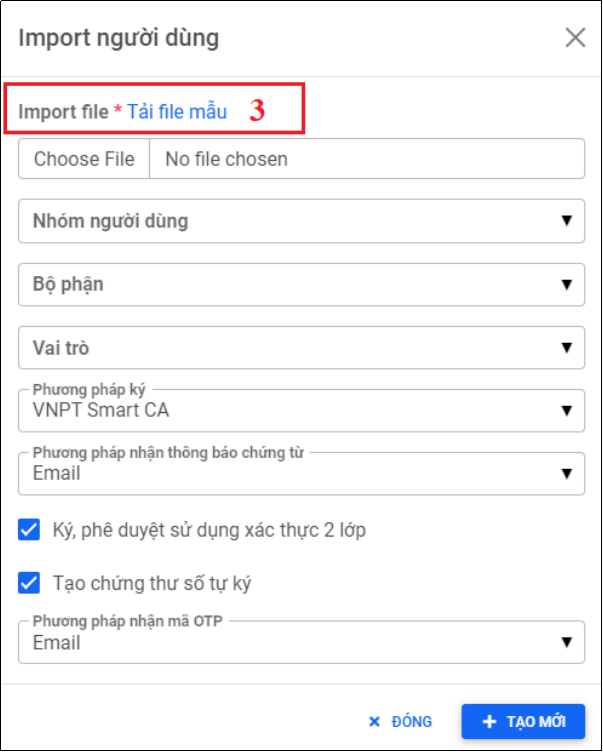
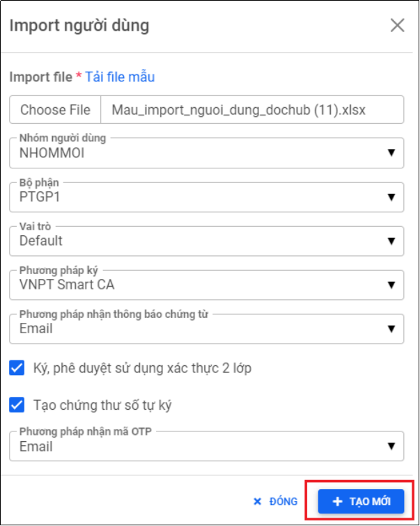

# 5. Tạo mới người dùng
## 5.1. Tạo mới một người dùng 
* **Bước 1: Truy cập vào màn hình danh sách người dùng**
  - Tại màn hình trang chủ, người dùng truy cập “Người dùng” > “Danh sách người dùng” để truy cập vào màn hình danh sách người dùng: 

Hình 27: Màn hình danh sách người dùng

* **Bước 2: Mở cửa sổ Tạo mới người dùng**
  - Tại màn hình danh sách người dùng (bước 1), nhấn chọn nút **“Tạo mới”**, Cửa sổ **“Tạo mới người dùng”** xuất hiện và người dùng thực hiện cập nhật đầy đủ các thông tin cần thiết để tạo mới một người dùng. 

Hình 28: Cửa sổ tạo mới người dùng

* Có 2 sự lựa chọn cho tên đăng nhập người dùng:
  * Sử dụng email làm tên đăng nhập 
  * Sử dụng SĐT làm tên đăng nhập
Khi người dùng chọn một trong hai, tên đăng nhập sẽ tự động điền email làm tên đăng nhập, ngược lại sẽ điền số điện thoại làm tên đăng nhập. Trường hợp mặc định, hệ thống sẽ chọn sử dụng email làm tên đăng nhập.

Một số trường bắt buộc:
  * Email/SĐT (tùy vào lựa chọn sử dụng email/SĐT làm tên đăng nhập)
  * Mã người dùng
  * Họ và tên
  
Ngoài ra, còn một số trường khác người dùng cần cập nhật để người dùng mới tạo có thể sử dụng các tính năng của hệ thống như:
  * Nhóm người dùng
  * Bộ phận
  * Vai trò
  * Trạng thái
  * Mã số thuế
  * Địa chỉ
  * Mô tả
  * Phương pháp nhận mã OTP (mặc định là qua Email)
  * Phương pháp ký (mặc định là VNPT SmartCA)
  * Phương pháp nhận thông báo chứng từ (mặc định là qua Email)

  Chọn có sử dụng xác thực 2 lớp khi xử lý chứng từ hay không và có tạo chứng thư số tự ký do hệ thống DocHub sinh ra cho mỗi cá nhân hay không. Mặc định hệ thống sẽ chọn các option này.

* **Bước 3: Tạo mới người dùng**

Sau khi hoàn thành cập nhật đầy đủ các thông tin trong cửa sổ tạo mới người dùng, người dùng thực hiện nhấn nút “Tạo mới” để hoàn tất tạo mới một người dùng trên hệ thống DocHub:

Hình 29: Điền đầy đủ thông tin của người dùng mới

Hệ thống thông báo tạo mới người dùng thành công:

Hình 30: Tạo mới một người dùng thành công

* **Bước 4: Kiểm tra email hoặc SMS** 
  
    Thông tin về tài khoản vừa được tạo sẽ được hệ thống gửi đến địa chỉ email hoặc SMS qua số điện thoại của người dùng chọn sử dụng làm tên đăng nhập đã được đăng ký trước đó, người dùng thực hiện đăng nhập hệ thống theo thông tin tài khoản thông báo:

Hình 31: Thông tin tài khoản được thông báo qua SMS

Hình 32: Thông tin tài khoản được thông báo qua email

## 5.2. Import người dùng bằng file excel
* **Bước 1: Truy cập vào màn hình danh sách người dùng**
Tại màn hình trang chủ, người dùng truy cập **“Người dùng”** > **“Danh sách người dùng”** để truy cập vào màn hình danh sách người dùng: 

Hình 33: Màn hình danh sách người dùng

* **Bước 2: Mở cửa sổ Import người dùng**
  
Tại màn hình danh sách người dùng (bước 1), nhấn chọn nút “Import người dùng”, Cửa sổ “Import người dùng” xuất hiện và người dùng thực hiện cập nhật đầy đủ các thông tin cần thiết để import người dùng.

Hình 34: Cửa sổ import người dùng

* **Bước 3: Tải và cập nhật file mẫu import người dùng**
  
Thực hiện tải xuống file mẫu excel import người dùng bằng cách nhấn vào tính năng **“Tải file mẫu”**, người dùng thực hiện cập nhật các thông tin cần thiết cho từng người dùng, mỗi người dùng là một hàng (tương tự cho từng người dùng), sau đó tải lên file vừa cập nhật thông qua trường “Import file” trên cửa sổ import người dùng.

Các thông tin bắt buộc bao gồm:
* Tên đăng nhập
* Họ và tên
* Mã người dùng
* Email hoặc SĐT
  
Ngoài ra, còn một số thông tin khác như:
* Mã số thuế
* Địa chỉ
* Mô tả

Một số lưu ý khi tạo người dùng bằng file import:
* Hệ thống sử dụng email hoặc số điện thoại làm tên đăng nhập
* Nếu người dùng chỉ có Email, hệ thống sử dụng Email làm tên đăng nhập và thông báo mật khẩu sẽ được gửi đến Email
* Nếu người dùng chỉ có SĐT, hệ thống sử dụng SĐT làm tên đăng nhập và thông báo mật khẩu sẽ được gửi đến SĐT
* Nếu người dùng có cả Email & SĐT, hệ thống sử dụng Email làm tên đăng nhập và thông báo mật khẩu sẽ gửi đến Email
* Nếu người dùng đã có tài khoản ở hệ thống nhưng khác công ty, thông báo sẽ được gửi mà không bao gồm mật khẩu

Hình 35: File mẫu import người dùng

* **Bước 4: Cập nhật thông tin cửa sổ import người dùng**

Sau khi người dùng đã tải lên lại file import đã cập nhật lên cửa sổ import người dùng, tiếp theo thực hiện cập nhật các thông tin có trên cửa sổ import người dùng như:
* Nhóm người dùng
* Bộ phận
* Vai trò
* Phương pháp ký (mặc định là VNPT SmartCA)
* Phương pháp nhận thông báo chứng từ (mặc định là qua Email)
* Phương pháp nhận mã OTP (mặc định là qua Email)
  
Ngoài ra, check chọn có sử dụng xác thực 2 lớp khi xử lý chứng từ hay không và có tạo chứng thư số tự ký do hệ thống DocHub sinh ra cho mỗi cá nhân hay không. Mặc định hệ thống sẽ chọn các option này.

Hình 36: Cập nhật đầy đủ thông tin import người dùng

* **Bước 5: Import người dùng**
  
Sau khi hoàn thành cập nhật đầy đủ các thông tin trong cửa sổ tạo mới người dùng, người dùng thực hiện nhấn nút “Tạo mới” để import hàng loạt người dùng vào hệ thống DocHub:

Hệ thống thông báo import người dùng thành công:

Hình 37: Import người dùng thành công

* **Bước 6: Kiểm tra email hoặc SMS**
 
Thông tin về tài khoản vừa được tạo sẽ được hệ thống gửi đến các địa chỉ email hoặc SMS qua số điện thoại của người dùng đăng ký trước đó trong file excel import người dùng, người dùng thực hiện đăng nhập hệ thống theo thông tin tài khoản thông báo:

Hình 38: Thông tin tài khoản được thông báo qua SMS

Hình 39: Thông tin tài khoản được thông báo qua email
