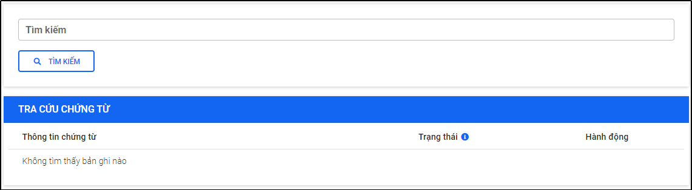
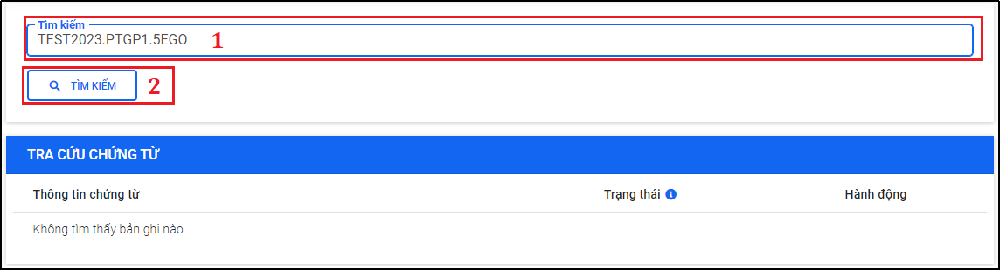
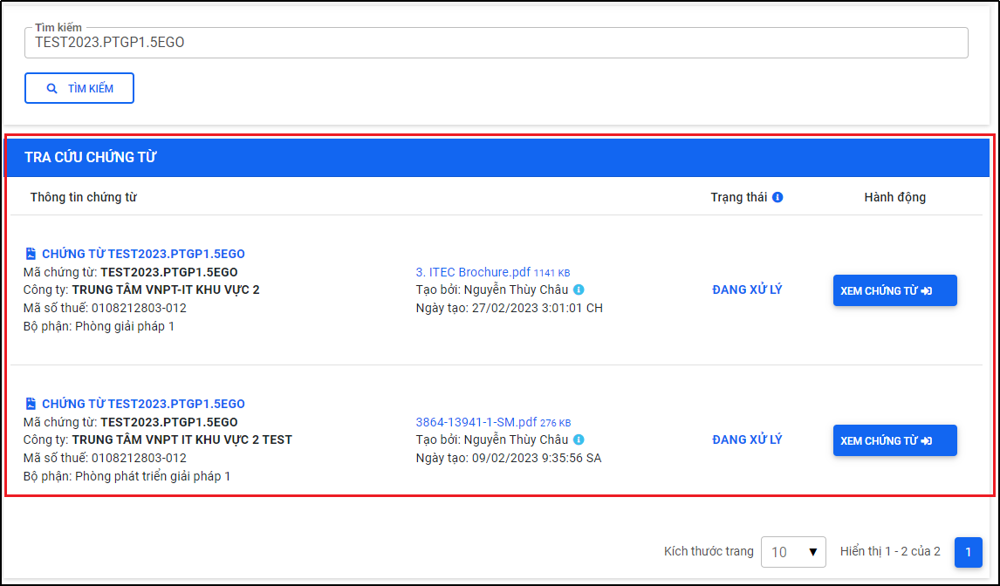
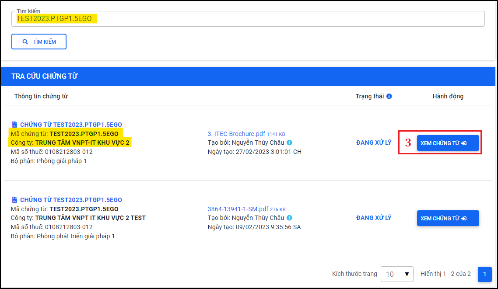
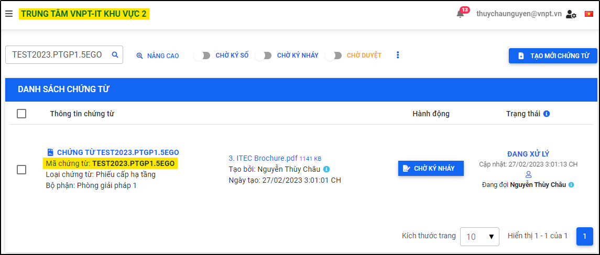

# 7. Tra cứu chứng từ
* Tính năng cho phép người dùng hệ thống tra cứu theo mã chứng từ trên tất các các Công ty/Chi nhánh mà người dùng thuộc về mà không cần chọn Công ty/Chi nhánh.
* Màn hình Tra cứu chứng từ: https://dochub.devitkv2.com/App/Home/LookUpDocument
* Người dùng thực hiện tìm kiếm theo mã chứng từ trong màn hình “Tra cứu chứng từ”, nếu có kết quả phù hợp, hệ thống sẽ hiển thị kết quả ngay bên dưới danh sách tra cứu chứng từ, người dùng có thể truy cập nhanh vào Công ty/Chi nhánh có chứa chứng từ để xem chứng từ tra cứu. 
* Sau khi người dùng nhấn “Xem chứng từ”, hệ thống sẽ chuyển hướng người dùng về nơi chứa chứng từ tra cứu (màn hình “Danh sách chứng từ” hoặc màn hình “Chứng từ chia sẻ”) tùy vào quyền truy cập của người dùng trên chứng từ tra cứu.

Hình 68: Giao diện màn hình Tra cứu chứng từ

Hình 69: Tra cứu chứng từ theo mã chứng từ

Hình 70: Kết quả tìm kiếm chứng từ được hiển thị

Hình 71: Truy cập vào Công ty/Chi nhánh chứa mã chứng từ vừa tra cứu

Hình 72: Chứng từ trong màn hình Danh sách chứng từ trong Công ty/Chi nhánh vừa truy cập

