# 11.Ký nháy (ký điện tử) chứng từ
## 11.1.Ký nháy một chứng từ
* **Bước 1: Nhận thông báo chứng từ cần xử lý**

Người thực hiện ký chứng từ sử dụng Link hoặc Mã xử lý được hệ thống thông báo qua Email hoặc SMS:

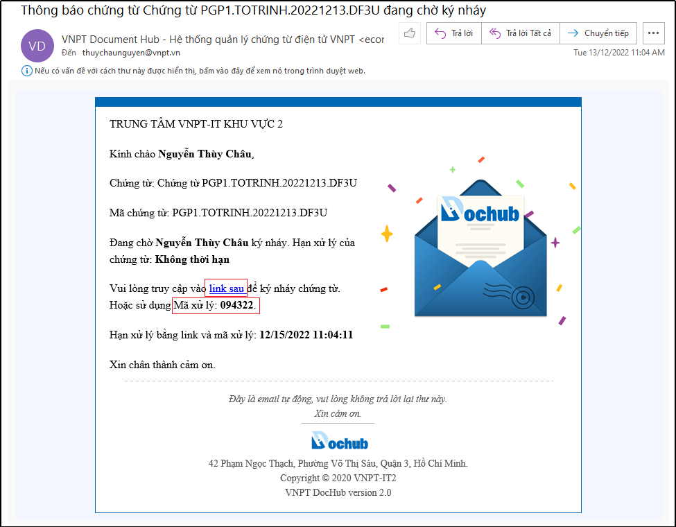

Hình 144: Link và Mã xử lý chứng từ được thông báo qua Email

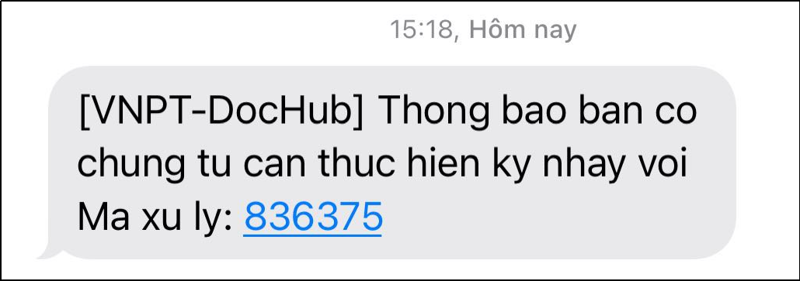

Hình 145: Mã xử lý được thông báo qua SMS

* **Bước 2: Mở màn hình xử lý chứng từ**

Nhấn vào link xử lý trong email thông báo chứng từ (bước 2) để vào màn hình xử lý chứng từ để thực hiện ký nháy chứng từ. 

Trường hợp sử dụng Mã xử lý thì phải đăng nhập vào hệ thống DocHub bằng mã xử lý.

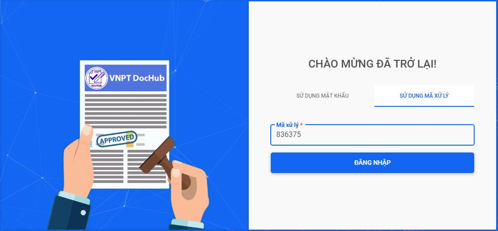

Hình 146: Đăng nhập bằng mã xử lý để vào màn hình xử lý chứng từ

Hình 147: Màn hình xử lý chứng từ

* **Bước 3: Điều chỉnh thông tin và hình ảnh chữ ký**
Thực hiện điều chỉnh các thông tin trước khi ký nháy(nếu cần) như: Vị trí ký, Nội dung chữ ký, Lí do, Kích cỡ phông chữ, Chọn hiển thị thông tin chữ ký: chỉ văn bản hoặc chỉ hình ảnh hoặc cả văn bản & hình ảnh, Thêm hình chữ ký hoặc vẽ chữ ký:

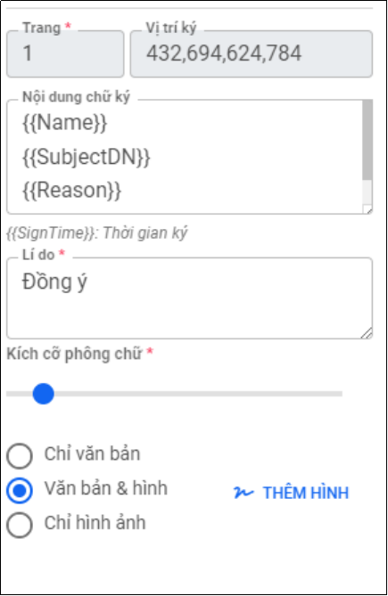

Hình 148: Các thông tin về chữ ký mà người ký có thể cập nhật trước khi ký chứng từ

Để thay đổi hình ảnh chữ ký, nhấn “**Thêm hình**” để thực hiện cập nhật hình ảnh chữ ký hoặc vẽ hình ảnh chữ ký của bạn.

Hình 149: Cập nhật hình ảnh chữ ký

* **Bước 4: Ký nháy chứng từ**

Nhấn nút “Ký nháy” trên màn hình để thực hiện ký nháy chứng từ. Tùy vào cấu hình mà người dùng cài đặt có yêu cầu xác thực 2 lớp bằng mã OTP hay không, hệ thống sẽ yêu cầu nhập thêm mã OTP được thông báo qua Email hoặc SMS nếu người dùng có cài đặt hoặc sẽ chỉ xác nhận thao tác ký nháy:

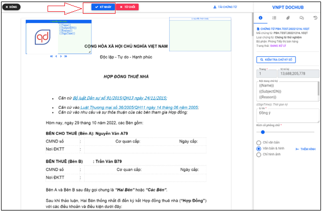

Hình 150: Nhấn "Ký nháy" để ký nháy chứng từ

* Trường hợp người dùng sử dụng xác thực 2 lớp: khi ký nháy chứng từ người ký phải nhập thêm mã OTP được thông báo qua Email hoặc SMS:

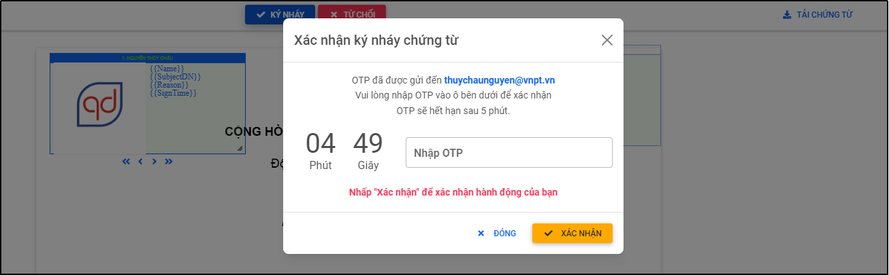

Hình 151: Trường hợp sử dụng xác thực 2 lớp

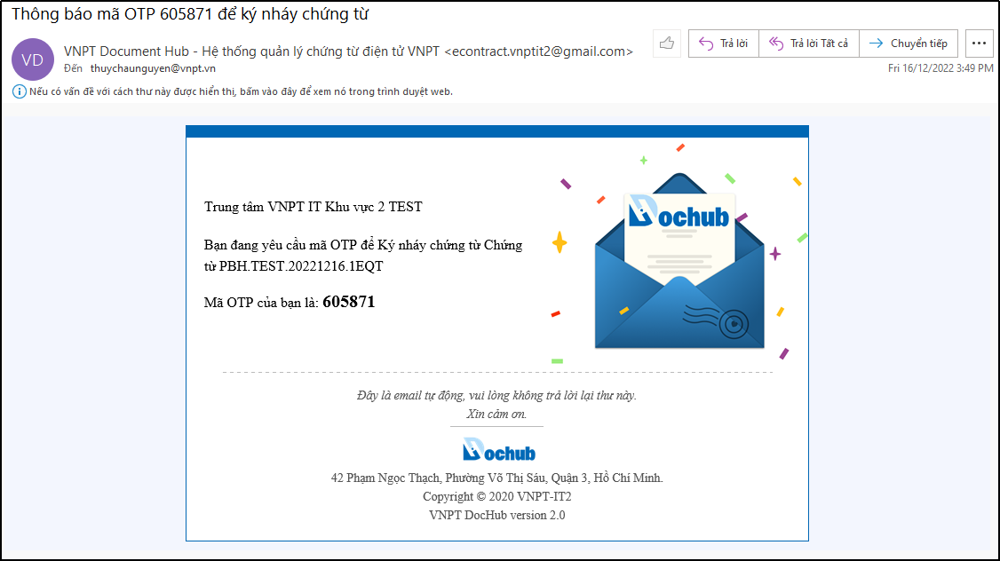

Hình 152: Thông báo email mã OTP xác thực 2 lớp

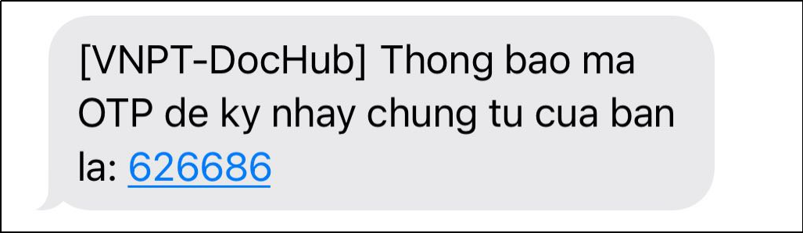

Hình 153: Thông báo SMS mã OTP xác thực 2 lớp

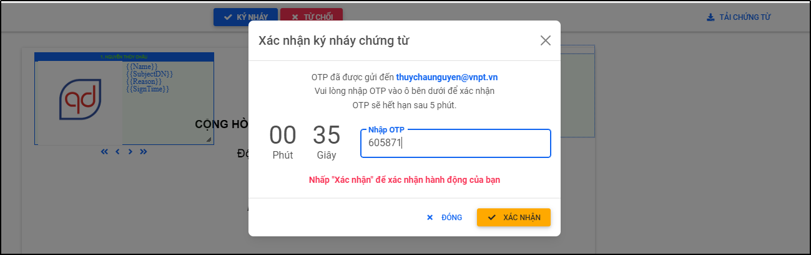

Hình 154: Nhập mã OTP để thực hiện ký nháy chứng từ

* Trường hợp người dùng không sử dụng xác thực 2 lớp:

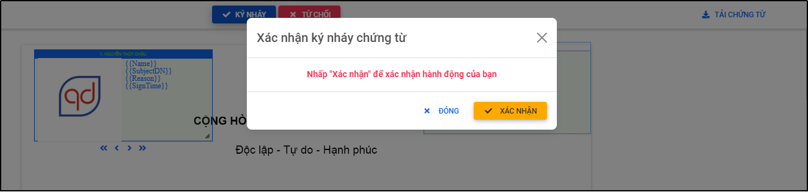

Hình 155: Trường hợp không sử dụng xác thực 2 lớp

Nhấn “Xác nhận” để hoàn tất ký nháy chứng từ:

## 11.2.Ký nháy hàng loạt (nhiều) chứng từ
- Tính năng cho phép người dùng ký nháy hàng loạt chứng từ cùng lô hoặc không cùng lô.
- Điều kiện để ký nháy hàng loạt chứng từ theo lô: chứng từ xử lý phải cùng một lô import và cùng quyền xử lý ký nháy.
- Điều kiện để ký nháy hàng loạt chứng từ không cùng một lô: chứng từ xử lý phải cùng cùng quyền xử lý ký nháy.
- Để tìm kiếm chứng từ cùng một lô, tại màn hình “Danh sách chứng từ” sử dụng bộ lọc “Nâng cao” trên màn hình để tìm kiếm lô chứng từ cần xử lý, chọn danh sách các chứng từ cần xử lý và thực hiện ký nháy chứng từ.
- Hoặc để tìm kiếm chứng từ có cùng quyền xử lý dành cho trường hợp xử lý hàng loạt chứng từ không cùng một lô. Tại màn hình “Danh sách chứng từ” sử dụng bộ lọc nhanh trên màn hình để tìm kiếm các chứng từ cùng quyền xử lý: ký nháy

Hình 157: Mở bộ lọc nâng cao tại màn hình Danh sách chứng từ

Hình 158: Tìm kiếm lô chứng từ cần xử lý bằng bộ lọc nâng cao

Hình 159: Màn hình kết quả danh sách các chứng từ trong lô cùng quyền xử lý

Hình 160: Bộ lọc nhanh và chọn danh sách chứng từ cùng quyền xử lý “Ký nháy”

Hình 161: Màn hình ký nháy chứng từ hàng loạt
- Người dùng thực hiện ký nháy chứng từ tương tự như xử lý ký nháy một chứng từ (Xem hướng dẫn Bước 4 tại mục 11.1)
- Ngoài ra, người dùng thực hiện nhấn <- hoặc -> để review chứng từ hoặc xem “Danh sách chứng từ” trước khi xử lý hàng loạt chứng từ không cùng lô hoặc không cùng một lô.

## 11.3.Từ chối ký nháy chứng từ
Trường hợp từ chối ký chứng từ, tương tự như ký chứng từ, sau khi hoàn thành bước 2 (Mở màn hình xử lý chứng từ) người ký nhấn nút “Từ chối” để từ chối ký chứng từ:

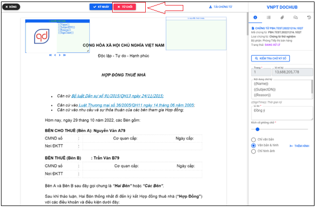

Hình 162: Nhấn "Từ chối" để từ chối ký nháy chứng từ
* Trường hợp người dùng sử dụng xác thực 2 lớp: khi từ chối ký nháy chứng từ người ký phải nhập thêm lý do từ chối và mã OTP được thông báo qua Email hoặc SMS:

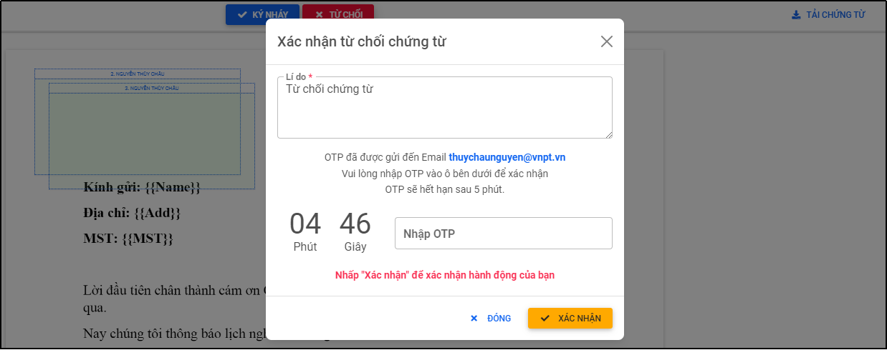

Hình 163: Trường hợp sử dụng xác thực 2 lớp

Hình 164: Thông báo email mã OTP xác thực 2 lớp

Hình 165: Thông báo SMS mã OTP xác thực 2 lớp

Nhập lý do và mã OTP để hoàn thành từ chối ký nháy chứng từ:

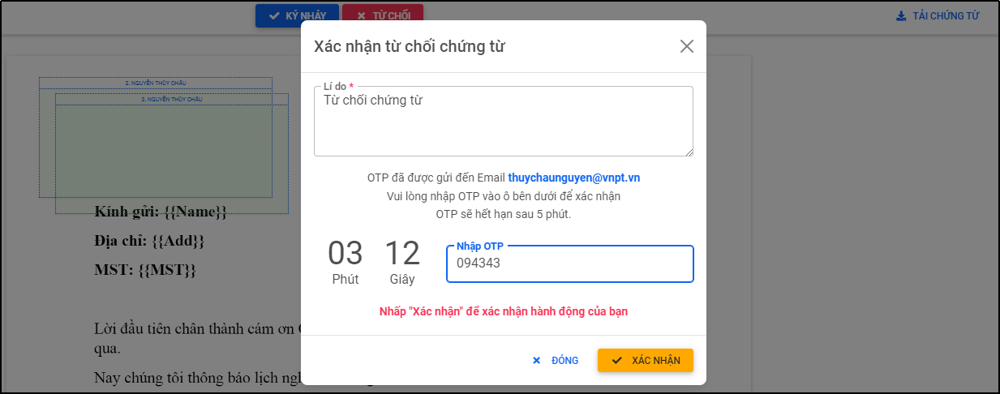

Hình 166: Nhập mã OTP để thực hiện từ chối ký nháy chứng từ
* Trường hợp người dùng không sử dụng xác thực 2 lớp: 

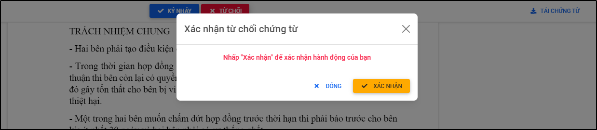

Hình 167: Trường hợp không sử dụng xác thực 2 lớp

Nhấn “Xác nhận” để từ chối ký chứng từ:

Hình 168: Thông báo từ chối chừng từ thành công