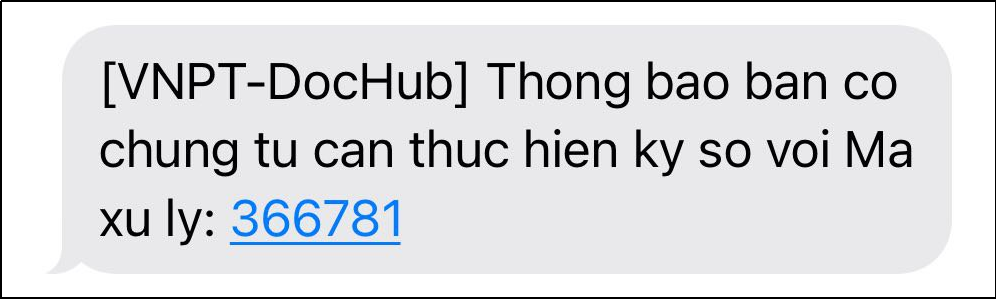
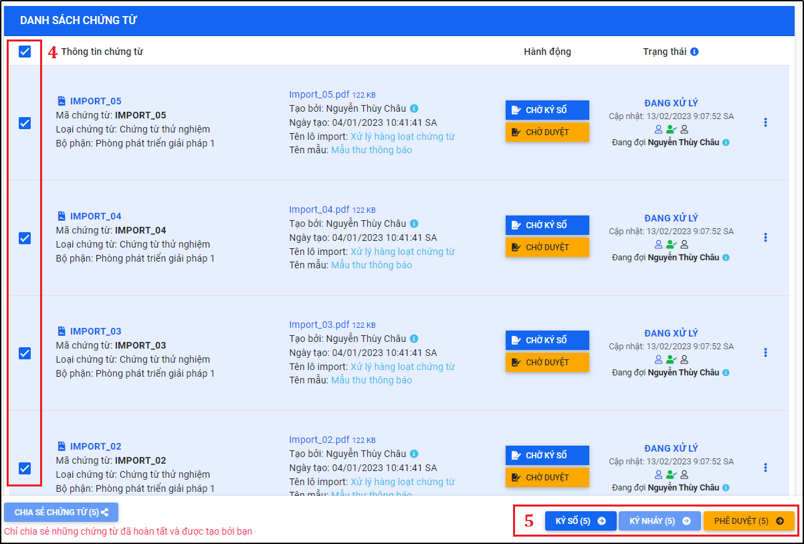

# 8.Ký số VNPT SmartCA cá nhân (App VNPT SmartCA)
## 8.1.Ký số một chứng từ bằng app VNPT SmartCA cho cá nhân
Trước khi thực hiện ký số SmartCA, người dùng cần thực hiện:
* Đăng ký và cài đặt sử dụng app VNPT SmartCA trên thiết bị di động để thực hiện ký số chứng từ bằng SmartCA.
* Kiểm tra và chọn đúng phương pháp ký số “VNPT SmartCA” trên hệ thống DocHub.

Thông tin đăng ký và tải ứng dụng: https://smartca.vnpt.vn/, chọn nền tảng tải phù hợp với thiết bị di động mà người dùng đang sử dụng:

Hình 73: Thông tin tải ứng dụng VNPT SmartCA

Sau khi hoàn thành cài đặt app trên thiết bị di động cá nhân, tiến hành đăng nhập tài khoản VNPT SmartCA và kiểm tra thông tin tài khoản trên hệ thống DocHub đã chọn đúng phương pháp ký số là **VNPT SmartCA* chưa, nếu chưa thì chọn lại cho đúng và lưu lại cập nhập:
- Đăng nhập VNPT Smart-CA trên DocHub:

Vào “**Tài khoản**” > “**Quản lý tài khoản**” > Chọn “**Đăng nhập VNPT SmartCA**” > Nhập “Tên đăng nhập” và “Mật khẩu” > Nhấn “**Đăng nhập**”

Hình 74: Đăng nhập tài khoản VNPT SmartCA trên DocHub

- Kiểm tra và cập nhật phương án ký: VNPT SmartCA:
 
Vào “**Tài khoản**” > “**Quản lý tài khoản**” > Chọn “**Cập nhật thông tin**” > Chọn “**Phương pháp ký**” là “**VNPT SmartCA**” > Nhấn “**Lưu**”

Hình 75: Chọn phương pháp ký "VNPT SmartCA"

Tiến hành ký số chứng từ bằng VNPT SmartCA:
* **Bước 1: Nhận thông báo chứng từ cần xử lý**

Người thực hiện ký số chứng từ sử dụng Link hoặc Mã xử lý được hệ thống thông báo qua Email hoặc SMS:

Hình 76: Link và Mã xử lý chứng từ được thông báo qua Email

Hình 77: Mã xử lý được thông báo qua SMS

## 8.2.Ký số hàng loạt (nhiều) chứng từ bằng app VNPT SmartCA cho cá nhân
- Cho phép người dùng xử lý hàng loạt chứng từ (cùng lúc nhiều chứng từ) trong cùng một lô import hoặc không cùng một lô.
- Điều kiện để xử lý hàng loạt chứng từ theo lô: chứng từ xử lý phải cùng một lô import và cùng quyền xử lý ký số.
- Điều kiện để xử lý hàng loạt chứng từ không cùng một lô: chứng từ xử lý phải cùng cùng quyền xử lý ký số.
- Để tìm kiếm chứng từ cùng một lô, tại màn hình “Danh sách chứng từ” sử dụng bộ lọc “Nâng cao” trên màn hình để tìm kiếm lô chứng từ cần xử lý, chọn danh sách các chứng từ cần xử lý và thực hiện ký số chứng từ
  

Hình 78: Mở bộ lọc nâng cao tại màn hình Danh sách chứng từ

Hình 79: Tìm kiếm lô chứng từ cần xử lý bằng bộ lọc nâng cao

Hình 80: Màn hình kết quả danh sách các chứng từ trong lô cùng quyền xử lý

- Hoặc để tìm kiếm chứng từ có cùng quyền xử lý dành cho trường hợp xử lý hàng loạt chứng từ không cùng một lô. Tại màn hình “Danh sách chứng từ” sử dụng bộ lọc nhanh trên màn hình để tìm kiếm các chứng từ cùng quyền xử lý: ký số 
  

- Chọn danh sách các chứng từ cần xử lý:

Hình 81: Chọn các chứng từ cần xử lý

- Tại đây, người dùng thực hiện ký số chứng từ cùng lô tương tự như xử lý ký số chứng từ không theo lô.
- Ngoài ra, người dùng thực hiện nhấn hoặc để review chứng từ hoặc xem “Danh sách chứng từ” trước khi xử lý hàng loạt chứng từ cùng lô.

Hình 82: Màn hình xử lý chứng từ hàng loạt theo lô

Nhấn “Xác nhận” và yêu cầu được hệ thống gửi yêu cầu qua app VNPT SmartCA trên thiết bị di động của bạn:

Hình 83: Cửa sổ yêu cầu người dùng xác nhận ký số chứng từ

Mở app VNPT SmartCA trên điện thoại để thực hiện ký số hàng loạt (nhiều) chứng từ:

Hình 84: Yêu cầu xác nhận ký số được gửi đến app VNPT SmartCA

Nhấn xác nhận “**Ký số**” trên ứng dụng VNPT SmartCA để hoàn tất ký số chứng từ:

Hình 85: Thông báo ký số thành công trên app VNPT SmartCA

Hình 86: Thông báo chứng từ được ký thành công trên hệ thống DocHub

## 8.3.Từ chối ký số chứng từ

Trường hợp từ chối ký chứng từ, tương tự như ký chứng từ, tại màn hình xử lý chứng từ người xử lý nhấn nút “Từ chối” để từ chối ký chứng từ:

Hình 87: Nhấn "Từ chối" để từ chối ký số chứng từ

* Trường hợp người dùng sử dụng xác thực 2 lớp: khi từ chối ký số chứng từ người ký phải nhập thêm lý do từ chối và mã OTP được thông báo qua Email hoặc SMS:

Hình 88: Trường hợp sử dụng xác thực 2 lớp

Hình 89: Thông báo email mã OTP xác thực 2 lớp

Hình 90: Thông báo SMS mã OTP xác thực 2 lớp

Nhập lý do và mã OTP để hoàn thành từ chối ký số chứng từ:

Hình 91: Nhập mã OTP để thực hiện từ chối ký số chứng từ

* Trường hợp người dùng không sử dụng xác thực 2 lớp: 

Hình 92: Trường hợp không sử dụng xác thực 2 lớp

Nhấn “Xác nhận” để từ chối ký chứng từ:

Hình 93: Thông báo từ chối chừng từ thành công
