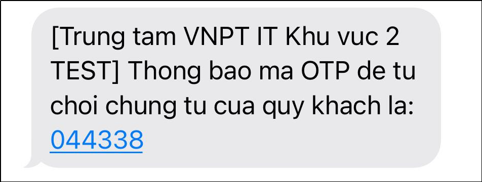

# 9.Ký số VNPT SmartCA doanh nghiệp (TOTP)
## 9.1.Ký số VNPT SmartCA doanh nghiệp (TOTP)
Ký số VNPT SmartCA doanh nghiệp hỗ trợ cho doanh nghiệp ký số hàng loạt (số lượng lớn) chứng từ bằng TOTP. Trước khi thực hiện ký số SmartCA, người dùng cần thực hiện:
* Đăng ký và đăng nhập tài khoản VNPT SmartCA doanh nghiệp tại: https://demorms.vnptit.vn/ (Nếu đã có tài khoản doanh nghiệp bạn có thể bỏ qua bước này)
* Lấy thông tin mã TOTP (copy mã TOTP)
* Đăng nhập tài khoản VNPT SmartCA doanh nghiệp trên hệ thống DocHub
* Kiểm tra và chọn đúng phương pháp ký số “**VNPT SmartCA**” trên hệ thống DocHub.

Thông tin đăng ký tài khoản: https://demorms.vnptit.vn/ (có thể bỏ qua bước này nếu đã có tài khoản VNPT SmartCA doanh nghiệp) và đăng nhập để truy cập vào hệ thống VNPT SmartCA để lấy mã TOTP:

Hình 94: Đăng ký tài khoảng doanh nghiệp VNPT SmartCA

- Sau khi hoàn thành đăng ký tài khoản doanh nghiệp, tiến hành đăng nhập và lấy thông tin mã TOTP trên tài khoản doanh nghiệp VNPT SmartCA vừa đăng ký:

Hình 95: Đăng nhập tài khoản VNPT SmartCA doanh nghiệp

- Lấy thông tin mã TOTP của doanh nghiệp:
  
Nhấn mũi tên đi xuống bên góc phải màn hình chỗ thông tin doanh nghiệp của bạn sau khi đăng nhập thành công, thông tin "Tài khoản" xuất hiện và nhấn vào menu "Tài khoản":

Hình 96: Vào màn hình "Tài khoản" để lấy mã TOTP

- Nhấn “Xem TOTP”

Hình 97: Lấy thông tin mã TOTP doanh nghiệp

- Nhập mã PIN và nhấn “Lấy mã TOTP”:

Hình 98: Nhập mã pin để lấy mã TOTP doanh nghiệp

- Sao chép mã TOTP trên tài khoản VNTP SmartCA doanh nghiệp, sau đó tiến hành truy cập vào hệ thống DocHub: https://dochub.devitkv2.com/ để thực hiện các bước tiếp theo:

Hình 99: Sao chép mã TOTP để tiến hành ký số VNPT SmartCA doanh nghiệp (TOTP)

- Đăng nhập VNPT Smart-CA doanh nghiệp trên DocHub:

Vào “**Tài khoản**” > “**Quản lý tài khoản**” > Chọn “**Đăng nhập VNPT SmartCA**” > Nhập “Tên đăng nhập”, “Mật khẩu” > chọn “Sử dụng tài khoản SmartCA doanh nghiệp” > Dán mã TOTP đã copy trước đó và ô “Khóa bí mật” > Nhấn “**Đăng nhập**”

Hình 100: Đăng nhập tài khoản VNPT SmartCA doanh nghiệp trên DocHub

Hình 101: Đăng nhập thành công tài khoản VNPT SmartCA doanh nghiệp trên DocHub

- Kiểm tra và cập nhật phương án ký VNPT SmartCA:

Vào “**Tài khoản**” > “**Quản lý tài khoản**” > Chọn “**Cập nhật thông tin**” > Chọn “**Phương pháp ký**” là “**VNPT SmartCA**” > Nhấn “**Lưu**”

Hình 102: Chọn phương pháp ký "VNPT SmartCA"

Tiến hành ký số chứng từ bằng VNPT SmartCA doanh nghiệp (TOTP):
- Cho phép người dùng là doanh nghiệp ký số hàng loạt chứng từ (cùng lúc nhiều chứng từ) trong cùng một lô import hoặc không cùng một lô.
- Điều kiện để ký số hàng loạt chứng từ theo lô: chứng từ ký số phải cùng một lô import và cùng quyền xử lý ký số.
- Điều kiện để ký số hàng loạt chứng từ không cùng một lô: chứng từ ký số phải cùng cùng quyền xử lý ký số.
- Để tìm kiếm chứng từ cùng một lô, tại màn hình “Danh sách chứng từ” sử dụng bộ lọc “Nâng cao” trên màn hình để tìm kiếm lô chứng từ cần xử lý, chọn danh sách các chứng từ cần xử lý và thực hiện ký số chứng từ

Hình 103: Mở bộ lọc nâng cao tại màn hình Danh sách chứng từ

Hình 104: Tìm kiếm lô chứng từ cần xử lý bằng bộ lọc nâng cao

Hình 105: Màn hình kết quả danh sách các chứng từ trong lô cùng quyền xử lý

- Hoặc để tìm kiếm chứng từ có cùng quyền xử lý dành cho trường hợp xử lý hàng loạt chứng từ không cùng một lô. Tại màn hình “Danh sách chứng từ” sử dụng bộ lọc nhanh trên màn hình để tìm kiếm các chứng từ cùng quyền xử lý: ký số
 

- Chọn danh sách các chứng từ cần ký số:

Hình 106: Chọn các chứng từ cần xử lý ký số

- Tại đây, người dùng thực hiện ký số chứng từ cùng lô tương tự như xử lý ký số chứng từ không theo lô.
- Ngoài ra, người dùng thực hiện nhấn <- hoặc -> để review chứng từ hoặc xem “Danh sách chứng từ” trước khi xử lý hàng loạt chứng từ cùng lô.

Hình 107: Màn hình xử lý chứng từ hàng loạt theo lô

Nhấn “Xác nhận” và hệ thống sẽ xử lý ký số bằng TOTP doanh nghiệp:

Hình 108: Cửa sổ yêu cầu người dùng xác nhận ký số chứng từ

Hình 109: Ký số TOTP thành công

## 9.2.Từ chối ký số VNPT SmartCA doanh nghiệp (TOTP)
Trường hợp từ chối ký chứng từ, tương tự như ký chứng từ, tại màn hình xử lý chứng từ người xử lý nhấn nút “Từ chối” để từ chối ký chứng từ:

Hình 110: Nhấn "Từ chối" để từ chối ký số chứng từ

* Trường hợp người dùng sử dụng xác thực 2 lớp: khi từ chối ký số chứng từ người ký phải nhập thêm lý do từ chối và mã OTP được thông báo qua Email hoặc SMS:

Hình 111: Trường hợp sử dụng xác thực 2 lớp

Hình 112: Thông báo email mã OTP xác thực 2 lớp

Nhập lý do và mã OTP để hoàn thành từ chối ký số chứng từ:

Hình 113: Nhập mã OTP để thực hiện từ chối ký số chứng từ

- Nếu người dùng sử dụng SMS làm phương án nhận OTP:

Hình 114: Thông báo SMS mã OTP xác thực 2 lớp

- Trường hợp người dùng không sử dụng xác thực 2 lớp: 

Hình 115: Trường hợp không sử dụng xác thực 2 lớp

Nhấn “Xác nhận” để từ chối ký chứng từ:

Hình 116: Thông báo từ chối chừng từ hàng loạt thành công

