# 12.Phê duyệt chứng từ
## 12.1.Phê duyệt một chứng từ
Người thực hiện phê duyệt chứng từ sử dụng Link hoặc Mã xử lý được hệ thống thông báo qua Email hoặc SMS:

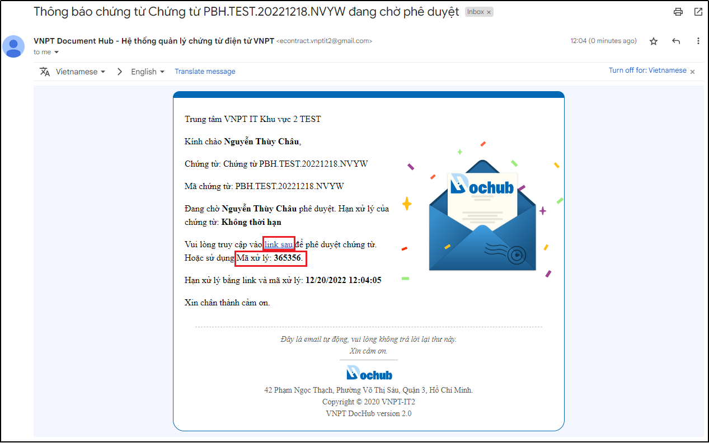

Hình 169: Link và Mã xử lý chứng từ được thông báo qua Email

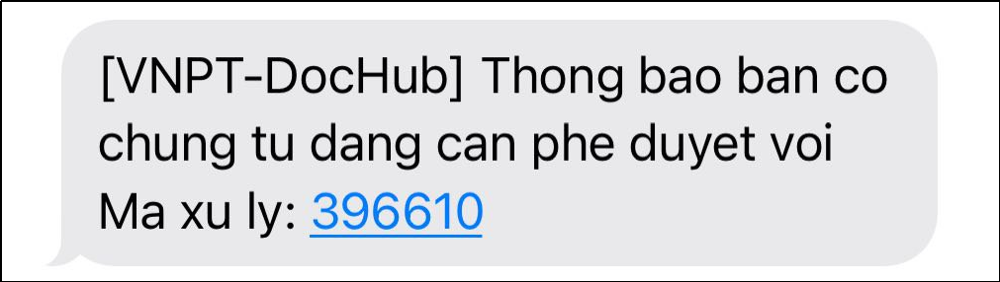

Hình 170: Mã xử lý được thông báo qua SMS

* **Bước 2: Mở màn hình xử lý chứng từ**
Nhấn vào link xử lý trong mail thông báo chứng từ (bước 2) để vào màn hình xử lý chứng từ để thực hiện phê duyệt chứng từ. 
Trường hợp sử dụng Mã xử lý thì phải đăng nhập vào hệ thống DocHub bằng mã xử lý.

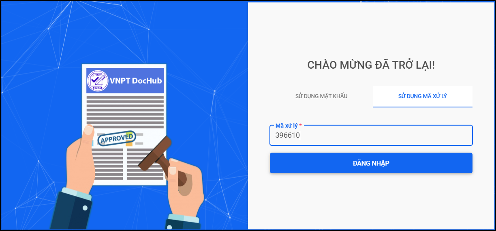

Hình 171: Đăng nhập bằng mã xử lý để vào màn hình xử lý chứng từ

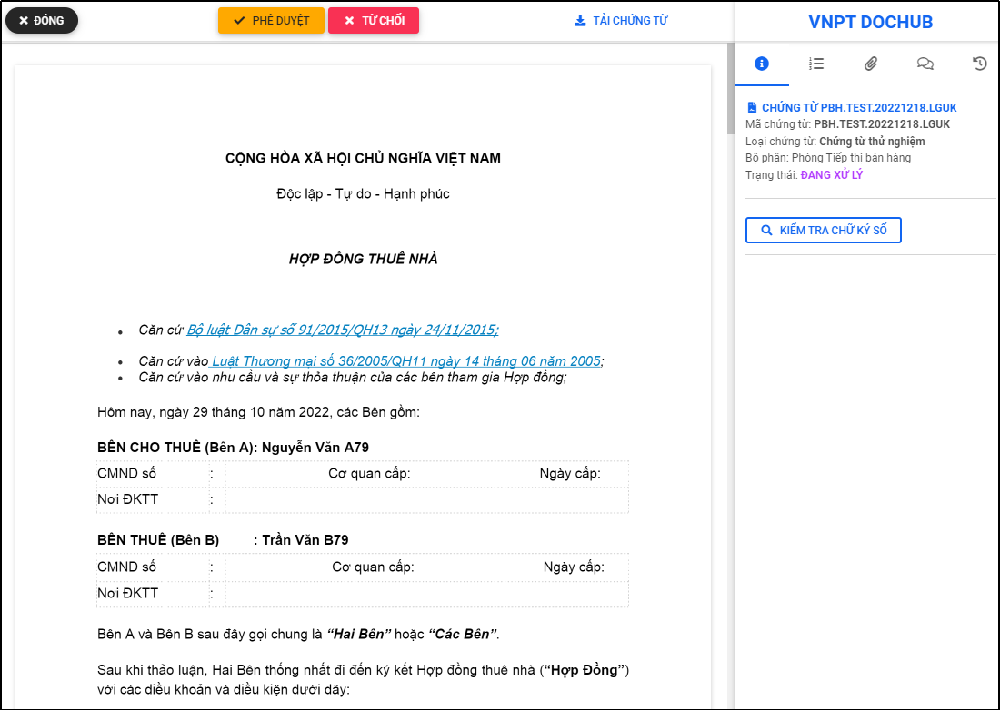

Hình 172: Màn hình xử lý chứng từ

* **Bước 3: Kiểm tra thông tin chứng từ và phê duyệt chứng từ**
Kiểm tra các thông tin trên chứng từ và nhấn nút “Phê duyệt” trên màn hình để thực hiện phê duyệt chứng từ. Tùy vào cấu hình mà người dùng cài đặt có yêu cầu xác thực 2 lớp bằng mã OTP hay không, hệ thống sẽ yêu cầu nhập thêm mã OTP được thông báo qua Email hoặc SMS nếu người dùng có cài đặt hoặc sẽ chỉ xác nhận thao tác phê duyệt:

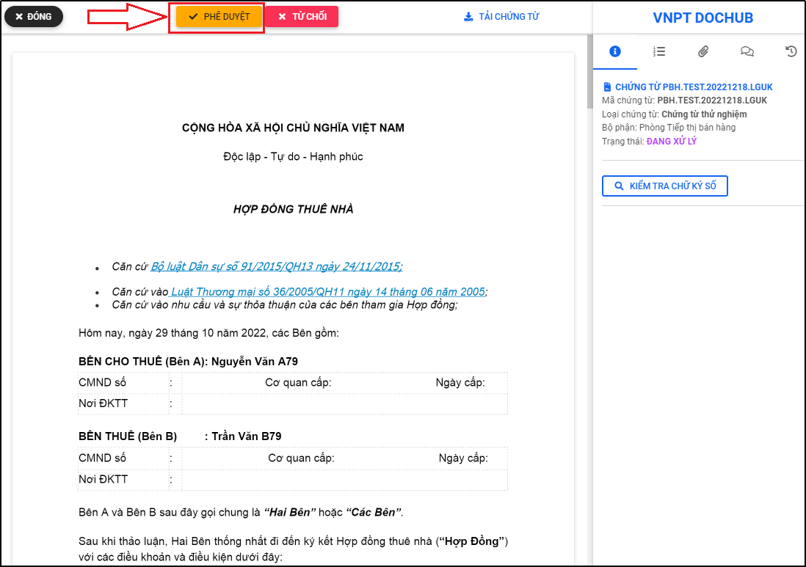

Hình 173: Nhấn "Phê duyệt" để phê duyệt chứng từ

* Trường hợp người dùng sử dụng xác thực 2 lớp: khi phê duyệt chứng từ người dùng phải nhập thêm mã OTP được thông báo qua Email hoặc SMS:

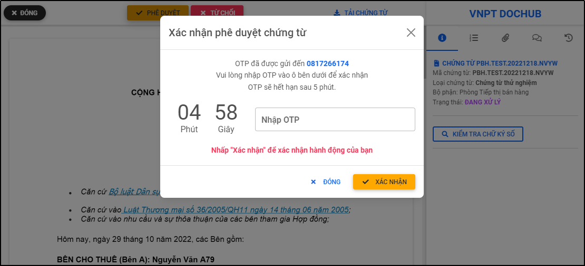

Hình 174: Trường hợp sử dụng xác thực 2 lớp

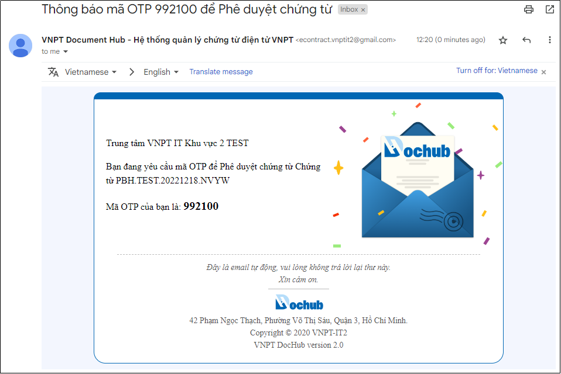

Hình 175: Thông báo qua email mã OTP xác thực 2 lớp

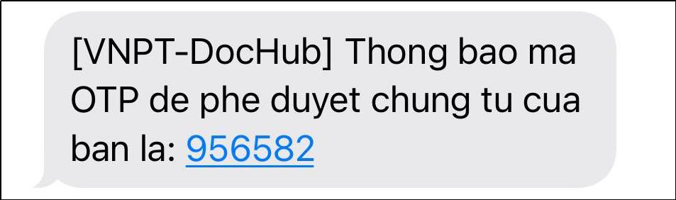

Hình 176: Thông báo qua SMS mã OTP xác thực 2 lớp

Sau khi nhận được mã OTP thông báo qua email hoặc SMS, người dùng nhập mã OTP và xác nhận thao tác phê duyệt chứng từ:

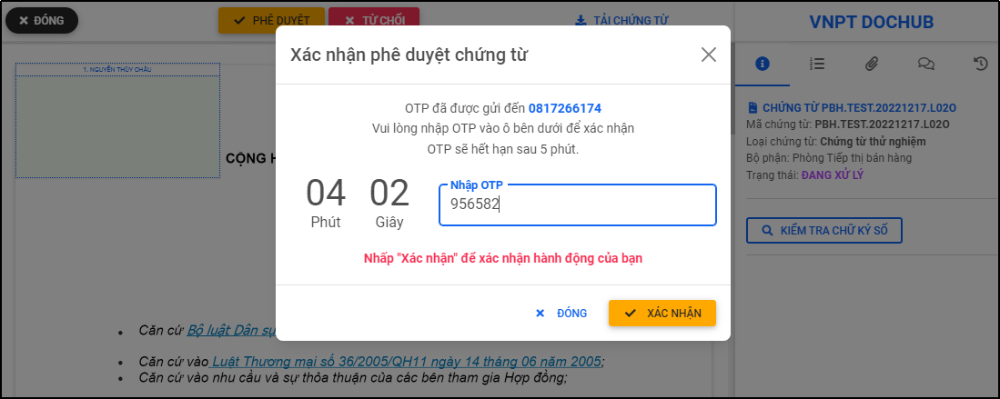

Hình 177: Nhập mã OTP để xác nhận phê duyệt chứng từ

* Trường hợp người dùng không sử dụng xác thực 2 lớp, người dùng không cần yêu cầu nhập mã OTP, chỉ cần nhấn “Xác nhận” để hoàn thành phê duyệt chứng từ:

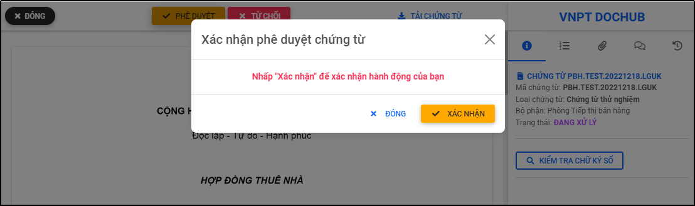

Hình 178: Trường hợp không sử dụng xác thực 2 lớp

	
Nhấn “Xác nhận” để hoàn tất phê duyệt chứng từ:

Hình 179: Thông báo phê duyệt chứng từ thành công

## 12.2. Phê duyệt hàng loạt (nhiều) chứng từ
- Tính năng cho phép người dùng phê duyệt hàng loạt chứng từ cùng lô hoặc không cùng lô.
- Điều kiện để phê duyệt hàng loạt chứng từ theo lô: chứng từ xử lý phải cùng một lô import và cùng quyền xử lý phê duyệt.
- Điều kiện để phê duyệt hàng loạt chứng từ không cùng một lô: chứng từ xử lý phải cùng cùng quyền xử lý phê duyệt.
- Để tìm kiếm chứng từ cùng một lô, tại màn hình “Danh sách chứng từ” sử dụng bộ lọc “Nâng cao” trên màn hình để tìm kiếm lô chứng từ cần xử lý, chọn danh sách các chứng từ cần xử lý và thực hiện phê duyệt chứng từ.
- Hoặc để tìm kiếm chứng từ có cùng quyền xử lý dành cho trường hợp xử lý hàng loạt chứng từ không cùng một lô. Tại màn hình “Danh sách chứng từ” sử dụng bộ lọc nhanh trên màn hình để tìm kiếm các chứng từ cùng quyền xử lý: phê duyệt

Hình 180: Chọn danh sách chứng từ cùng quyền xử lý “Phê duyệt”

Hình 181: Màn hình phê duyệt chứng từ hàng loạt không cùng lô

- Người dùng thực hiện phê duyệt chứng từ tương tự như xử lý phê duyệt một chứng từ (Xem hướng dẫn bước 3 mục 12.1).
- Ngoài ra, người dùng thực hiện nhấn hoặc để review chứng từ hoặc xem “Danh sách chứng từ” trước khi xử lý hàng loạt chứng từ không cùng lô.
## 12.3. Từ chối phê duyệt chứng từ
Trường hợp từ chối ký phê duyệt chứng từ, tương tự như phê duyệt chứng từ, sau khi hoàn thành bước 2 (Mở màn hình xử lý chứng từ) người phê duyệt nhấn nút “Từ chối” để từ chối phê duyệt chứng từ:

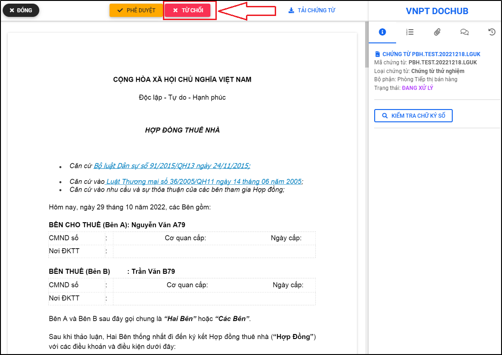

Hình 182: Nhấn "Từ chối" để từ chối phê duyệt chứng từ

* Trường hợp người dùng sử dụng xác thực 2 lớp, người dùng phải nhập lý do từ chối và mã OTP xác nhận được thông báo qua email hoặc SMS:

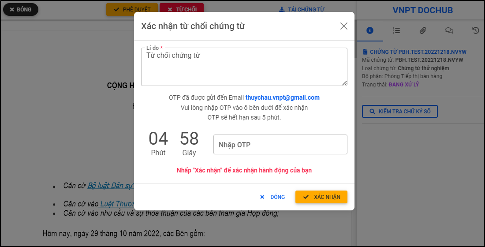

Hình 183: Trường hợp sử dụng xác thực 2 lớp

Mã OTP được thông báo qua email hoặc SMS:

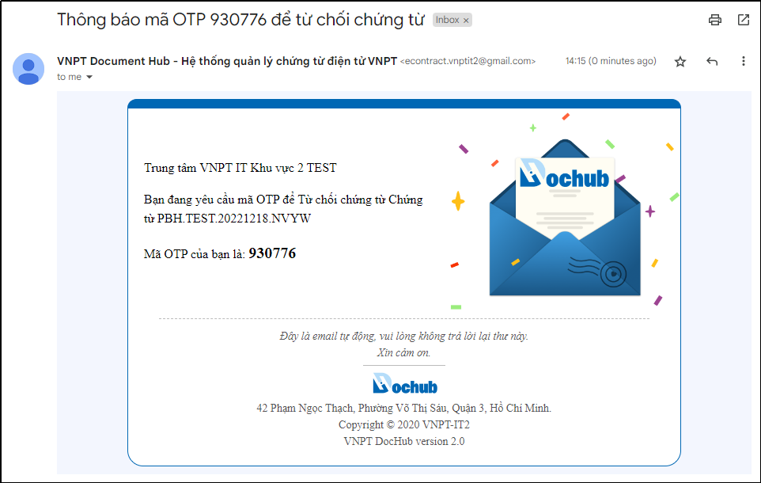

Hình 184: Thông báo qua email mã OTP xác thực 2 lớp

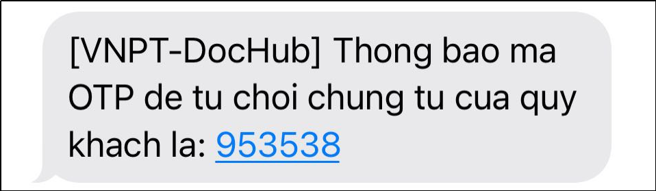

Hình 185: Thông báo qua SMS mã OTP xác thực 2 lớp

Nhập lý do và mã OTP để hoàn thành từ chối phê duyệt chứng từ:

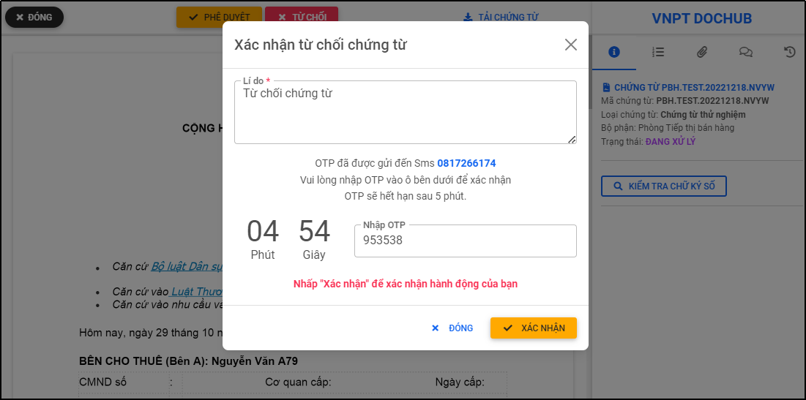

Hình 186: Nhập mã OTP để xác nhận từ chối chứng từ

*Trường hợp người dùng không sử dụng xác thực 2 lớp, người dùng không cần yêu cầu nhập mã OTP, chỉ cần nhấn “Xác nhận” để hoàn thành từ chối phê duyệt chứng từ:

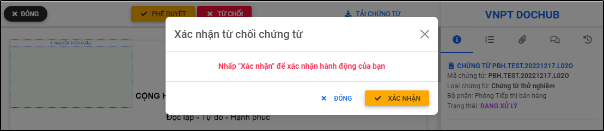

Hình 187: Trường hợp không sử dụng xác thực 2 lớp

Nhấn “Xác nhận” để hoàn tất từ chối phê duyệt chứng từ:

Hình 188: Thông báo từ chối phê duyệt chứng từ thành công
